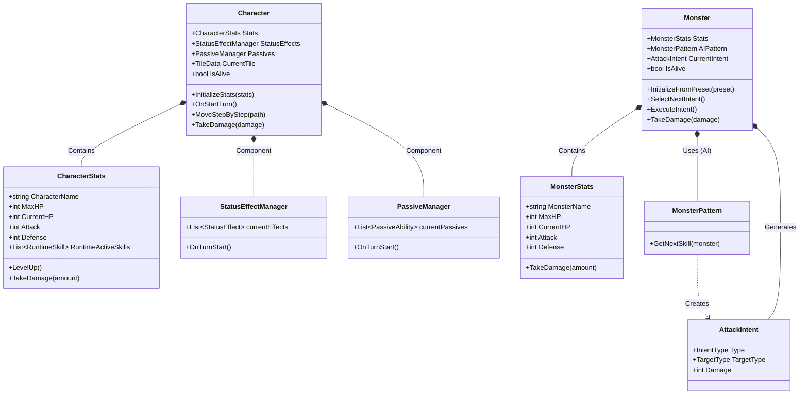

# 캐릭터 및 몬스터 구조도 (Character & Monster Structure)

이 문서는 `Character`와 `Monster` 클래스의 구조와 관계를 시각화합니다.
다이어그램이 보이지 않을 경우 하단의 텍스트 구조도(ASCII)를 참고해 주세요.

## 1. 클래스 다이어그램 (Class Diagram)



## 2. 텍스트 구조도 (Text Structure)

Mermaid 다이어그램이 보이지 않는 경우 아래 구조를 참고하세요.

### Character (플레이어)
```text
[Character (MonoBehaviour)]
  │
  ├── [CharacterStats] (데이터)
  │     ├── HP / Attack / Defense
  │     ├── Skills (List<RuntimeSkill>)
  │     └── LevelUp(), TakeDamage()
  │
  ├── [StatusEffectManager] (컴포넌트)
  │     └── 버프/디버프 관리 (TurnStart 처리)
  │
  └── [PassiveManager] (컴포넌트)
        └── 패시브 스킬 효과 처리
```

### Monster (적)
```text
[Monster (MonoBehaviour)]
  │
  ├── [MonsterStats] (데이터)
  │     └── HP / Attack / Defense
  │
  ├── [MonsterPattern] (AI 로직)
  │     └── GetNextSkill() -> 다음 행동 결정
  │
  └── [AttackIntent] (현재 행동 의도)
        ├── Type (공격/방어/버프)
        ├── Target (단일/광역)
        └── Damage (피해량)
```

## 주요 구성 요소 설명

### 1. Character (플레이어)
*   **역할**: 플레이어가 조작하는 유닛입니다. 타일 위를 이동하며 전투를 수행합니다.
*   **주요 컴포넌트**:
    *   `CharacterStats`: 체력, 공격력, 방어력, 스킬 쿨타임 등 수치 데이터를 관리합니다.
    *   `StatusEffectManager`: 버프/디버프 상태이상을 관리합니다.
    *   `PassiveManager`: 캐릭터의 패시브 스킬 효과를 처리합니다.

### 2. Monster (적)
*   **역할**: 웨이브마다 등장하여 플레이어를 공격하는 적 유닛입니다.
*   **주요 컴포넌트**:
    *   `MonsterStats`: 몬스터의 기본 능력을 정의합니다.
    *   `MonsterPattern`: 몬스터의 AI 행동 패턴을 결정합니다.
*   **AI 동작 방식**:
    *   `SelectNextIntent`: `MonsterPattern`을 통해 다음 턴에 할 행동(`AttackIntent`)을 결정합니다.
    *   `ExecuteIntent`: 몬스터 턴이 오면 실제 행동을 수행합니다.
