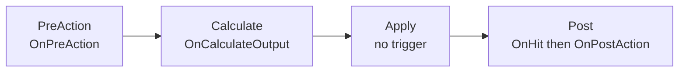

# Combat Pipeline Authoring Guide

This document is a practical authoring reference for building active skills, passives/reactors,
status effects, and VFX on top of the combat pipeline. It reflects current code behavior
(Unity 2022.3).

For the deep dispatch mechanics and the context/action data-model, see the companion docs:

- `Docs/combat_reactor_dispatch.md` — how `ICombatReactor` dispatches to typed hooks (DIM).
- `Docs/combat_context_action_merge_design.md` — why `CombatAction` was merged into `CombatContext`.

## 1. Core model

Everything that "does something" in combat is packaged as a `CombatContext` subclass and pushed
through `CombatPipeline.Instance.Process(context)`. Reactors (passives, status effects, artifacts,
tiles, modifiers) observe and mutate that context as it flows through the phases.

- **Runtime payload**: `CombatContext` (abstract base). Concrete subclasses:
  - `AttackContext` / `HealContext` (both extend `EffectContext`: carry `Name`, `BaseValue`,
    `OutputValue`, `Tags`, `Effects`).
  - `MoveContext` (`Steps`).
  - `TurnEventContext` (`EventPhase Phase` = `TurnStart` / `TurnEnd` / `TileTick`).
- **Execution engine**: `CombatPipeline.Instance.Process(context)`.
- **Reactive consumers**: anything implementing `ICombatReactor` — character passives
  (`CharacterPassiveSkill`), monster passives (`PassiveAbility`), `StatusEffect`, artifacts,
  `CharacterModifier`, `TileData` / `TileAttribute`.

> Note: the old `ActionType Type` migration shim was **removed (2026-07-21)** — `ActionType`
> no longer exists. Branch on the concrete context type (`AttackContext`, `HealContext`, ...)
> via the typed hooks.

## 2. Data path (actual)

1. `CharacterPreset.StartingActives` holds `[SerializeReference] List<CharacterActiveSkill>`
   (passives live in a separate `StartingPassives` list of `CharacterPassiveSkill`).
2. Each active is wrapped at runtime by an `ActiveSkillSlot` (`RuntimeAbility.cs`) which holds
   `BaseSkill`, `CurrentLevel`, and a per-run `RuntimeInstance` clone.
3. `SkillManager.PrepareSkill(character, skillIndex, diceData)` validates the dice requirement and
   resolves targeting from the slot's effective `CharacterSkillTargetType` / `PreviewStyle` /
   `TargetCount` (single/multi/tile) via `SkillTargetSelector`, or does immediate `ActionQueue`
   registration.
   **The modifier pass happens here**, lazily: those slot getters call
   `ActiveSkillSlot.BuildEffectiveContext()`, which runs `skill.GenerateContext(owner, slot)` then
   `Owner.Stats.Modifiers.ApplyTo(ctx)` — so modifiers can change target type/count *before* selection.
4. On confirm, `ActiveSkillSlot.Execute(...)` just forwards to the per-run
   `RuntimeInstance.Execute(...)` (i.e. `CharacterActiveSkill.Execute`); it does **not** re-run the
   modifier pass.
5. Inside `Execute`, the skill builds an `AttackContext` / `HealContext` per target and calls
   `CombatPipeline.Instance.Process(context)`.
6. `CombatPipeline` runs the phases and applies the final result to `Unit.TakeDamage` /
   `Unit.Heal`; buff/debuff/DoT `Effects` are delegated to `StatusEffectManager`.

## 3. The 4-phase pipeline

`CombatPipeline.Process(context)` runs exactly four phases. Each phase broadcasts one
`CombatTrigger` to every collected reactor:



| Phase | Trigger(s) fired | Purpose |
| --- | --- | --- |
| PreAction | `OnPreAction` | Gate the action (cancel checks, cost, dodge RNG). Setting `context.IsCancelled` here stops the pipeline. |
| Calculate | `OnCalculateOutput` | Buffs/debuffs/passives adjust `OutputValue`. Attack output is clamped to `>= 0`. |
| Apply | *(none)* | `AttackContext` -> `Target.TakeDamage`; `HealContext` -> `Target.Heal`; then each `EffectContext.Effects` entry is applied (damage/heal direct, everything else via `StatusEffectManager`). |
| Post | `OnHit`, then `OnPostAction` | Reactions after the hit lands (counters, on-hit riders, cleanup). |

`CombatTrigger` is exactly:

```csharp
enum CombatTrigger { OnPreAction, OnCalculateOutput, OnHit, OnPostAction }
```

There is **no** `OnTurnStart` / `OnTurnEnd` / `OnActionSuccess` / `OnDamaged` / `OnKill` /
`OnDeath` trigger. **Turn events are not triggers** — they ride on a `TurnEventContext` whose
`EventPhase` is `TurnStart` / `TurnEnd` / `TileTick`, broadcast through the same pipeline. React to
them by overriding `OnTurnEvent(trigger, TurnEventContext)`.

`NotifyReactors` collects reactors from, in order: the source unit + target unit passives, the
whole party's passives, active status effects, artifacts (`ArtifactManager`), and tiles
(`OrbitManager.Tiles` -> `TileData`). Reactors are sorted by `Priority` (descending), de-duplicated,
then invoked; a reactor may short-circuit the rest by setting `IsCancelled`.

There is also `SimulateCalculation(EffectContext)` which runs only `OnCalculateOutput` with
`IsSimulation = true` for damage previews. Reactors must skip side effects (notifications, stack
consumption) when `context.IsSimulation` is true.

## 4. Authoring an active skill

Active skills are `[Serializable]` classes (NOT ScriptableObjects) referenced by
`[SerializeReference]`. Subclass `CharacterActiveSkill` and implement the abstract members.

Minimum contract:

- `int CalculateRawDamage(Character source, ActiveSkillSlot ability, int diceValue)` — base value
  before pipeline reactors.
- `string BuildPreview(Character source, ActiveSkillSlot ability, int diceValue)` — tooltip text.
- Optionally override `Execute(...)` if you need custom targeting/looping, and
  `GenerateContext(...)` to supply a skill-specific modifier context.

The base `Execute` already implements the common attack loop: play cast VFX, build one
`AttackContext` per target, run it through the pipeline, play hit VFX. Author a custom `Execute`
only when you need heal contexts, multi-hit, or effect riders. Pattern:

```csharp
public override bool Execute(Character source, ActiveSkillSlot ability,
    List<Unit> targets, List<TileData> targetTiles, int diceValue)
{
    int raw = CalculateRawDamage(source, ability, diceValue);
    VfxManager.PlayCast(vfxProfile, source);            // cast VFX, inline

    foreach (var target in targets)
    {
        if (target == null || !target.IsAlive) continue;

        var ctx = new AttackContext(source, target, skillName, raw);
        if (vfxProfile != null) ctx.AddTag("CustomVfx"); // suppress default hit VFX
        // Optional status rider applied during Apply phase:
        // ctx.AddEffect(EffectType.Dot, value: 3, duration: 2);
        CombatPipeline.Instance?.Process(ctx);

        if (ctx.IsEffected) VfxManager.PlayHit(vfxProfile, target); // hit VFX, inline
    }

    OnAfterResolved(source, ability);
    return true;
}
```

Notes:

- Build a `HealContext(source, target, skillName, amount)` instead for healing skills; the Apply
  phase routes it to `Target.Heal` and default heal VFX (`PlayDefaultHeal`).
- `vfxProfile` is a `[SerializeField] CombatVfxProfile` on the skill. VFX is played **inline** in
  `Execute` (`VfxManager.PlayCast` / `PlayHit`), not by a separate effect object.
- The `"CustomVfx"` tag suppresses the pipeline's default hit VFX: the Apply phase only plays
  `PlayDefaultAttackHit` when `atk.IsEffected && !atk.HasTag("CustomVfx")`.
- Target resolution comes from `CharacterSkillTargetType` (`OneEnemy`, `MultiEnemy`, `OneAlly`,
  `MultiTile`, `AllTiles`, ...) on the skill; `SkillManager` + `SkillTargetSelector` handle the
  radial cursor and preview. Damage preview tooltips are only shown for `OneEnemy` / `MultiEnemy`.
- Register the finished skill in the character preset's `StartingActives` list (Inspector,
  SerializeReference).

## 5. Authoring a reactor / passive

A reactor is anything that observes the pipeline. Two authoring bases exist:

- `CharacterPassiveSkill` (`CharacterPassive.cs`) — player-character passives.
- `PassiveAbility` (`PassiveAbility.cs`) — monster passives.

Both are `[Serializable]` classes implementing `IPassive : ICombatReactor` (NOT ScriptableObjects).

**Implement only the typed hooks you need.** `ICombatReactor` provides a default `OnReact` (a
default interface method) that switches on the concrete context type and forwards to typed hooks
with empty default bodies:

```csharp
void OnAttack(CombatTrigger trigger, AttackContext context) { }
void OnHeal (CombatTrigger trigger, HealContext context)   { }
void OnMove (CombatTrigger trigger, MoveContext context)   { }
void OnTurnEvent(CombatTrigger trigger, TurnEventContext context) { }
```

Do **not** override `OnReact` and type-cast the context yourself — that is the old pattern. Only
propagating containers (`PassiveManager`, `StatusEffectManager`, `TileData`) override `OnReact`.

Example: a damage-boosting character passive overrides only `OnAttack`, gates on the trigger and
owner, mutates `OutputValue`, and skips notification during simulation:

```csharp
public void OnAttack(CombatTrigger trigger, AttackContext context)
{
    if (owner == null) return;
    if (trigger != CombatTrigger.OnCalculateOutput) return; // pick your phase
    if (context.SourceUnit != owner) return;

    context.OutputValue *= multiplier;
    if (!context.IsSimulation) Notify();  // CombatNotifier bubble
}
```

Guidelines:

- Always gate on the `CombatTrigger` (e.g. `OnCalculateOutput` for damage math, `OnHit` /
  `OnPostAction` for on-hit riders) and on whether `SourceUnit` / `Target` is your owner.
- For turn-based logic (start/end/tile-tick) override `OnTurnEvent` and branch on `context.Phase`.
- Use `Priority` to order stacking reactors (higher runs first). Multiplicative vs additive order
  matters.
- Use `Notify()` / `Notify(text)` / `Notify(text, color)` helpers (`CombatNotifier`) to surface the
  proc; guard them behind `!context.IsSimulation`.
- Register the passive in the preset's `StartingPassives` (characters) or the monster preset
  (monsters).

## 6. Applying status effects

Effects (buff / debuff / DoT / shield / etc.) are not applied by hand — they go through
`StatusEffectManager`. Two entry points:

1. **Declaratively from an effect action.** During Apply, each entry in `EffectContext.Effects` is
   processed by the pipeline. Add one with the helper on the context:

   ```csharp
   context.AddEffect(EffectType.Dot, value: 3, duration: 2);
   ```

   For non-damage/heal `EffectType`s the pipeline calls
   `StatusEffectManager.CreateEffect(type, value, duration)` -> `target.StatusEffects.AddEffect(...)`
   and fires `CombatNotifier.NotifyStatus`.

2. **Imperatively from any code** (a passive proc, monster AI, tile):

   ```csharp
   var effect = StatusEffectManager.CreateEffect(EffectType.BuffAttack, value, duration);
   target.StatusEffects.AddEffect(effect);
   ```

`EffectType` lives in `EffectData.cs` (the `EffectData` wrapper class itself is dead; the enum is
live). A `StatusEffect` is itself an `ICombatReactor` using the same typed hooks. Its duration
**decrements at TURN START** via `OnTurnEvent` when `Phase == TurnStart`; `StatusEffectManager`
runs `CleanupExpiredEffects` at turn start.

## 7. VFX

- `CombatVfxProfile` (ScriptableObject) holds `castVfxPrefab`, `hitVfxPrefab`, `healVfxPrefab`,
  `tileVfxPrefab`, offsets, and `defaultLifetime`. The profile lives on the `CharacterActiveSkill`.
- `VfxManager` static API: `PlayCast`, `PlayHit`, `PlayHeal`, `PlayTile`, `PlayDefaultAttackHit`,
  `PlayDefaultHeal`.
- VFX is played inline in `CharacterActiveSkill.Execute` (see section 4). There is no separate
  effect object.
- Profiles live at `Assets/Resources/Skill/VFX/<Class|Goblin>_CombatVfxProfile.asset`.

## 8. Related files

- `Assets/Scripts/Core/Stage/BattleStage/BattleStageSystem/Combat/Pipeline/CombatPipeline.cs`
- `Assets/Scripts/Core/Stage/BattleStage/BattleStageSystem/Combat/Pipeline/CombatContext.cs`
- `Assets/Scripts/Core/Stage/BattleStage/BattleStageSystem/Combat/Pipeline/ICombatReactor.cs`
- `Assets/Scripts/Core/Stage/BattleStage/BattleStageSystem/Combat/Skills/CharacterActiveTemplate.cs`
- `Assets/Scripts/Core/Stage/BattleStage/BattleStageSystem/Combat/Skills/RuntimeAbility.cs`
- `Assets/Scripts/Core/Stage/BattleStage/BattleStageSystem/Combat/SkillManager.cs`
- `Assets/Scripts/Core/Stage/BattleStage/BattleStageSystem/Combat/Passive/CharacterPassive.cs`
- `Assets/Scripts/Core/Stage/BattleStage/BattleStageSystem/Combat/Passive/PassiveAbility.cs`
- `Assets/Scripts/Core/Stage/BattleStage/BattleStageSystem/Combat/Effects/StatusEffectManager.cs`
- `Assets/Scripts/Core/Stage/BattleStage/BattleStageSystem/Combat/Effects/EffectData.cs`
- `Assets/Scripts/Visuals/VfxManager.cs`
- `Docs/combat_reactor_dispatch.md`, `Docs/combat_context_action_merge_design.md`
