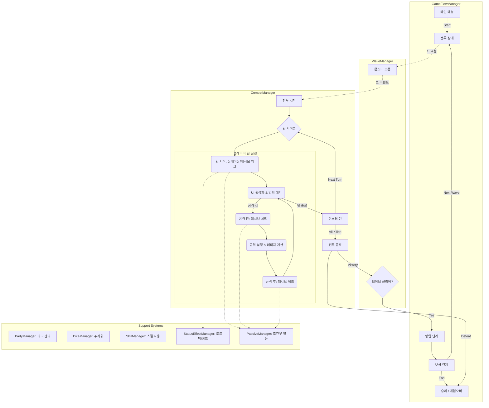
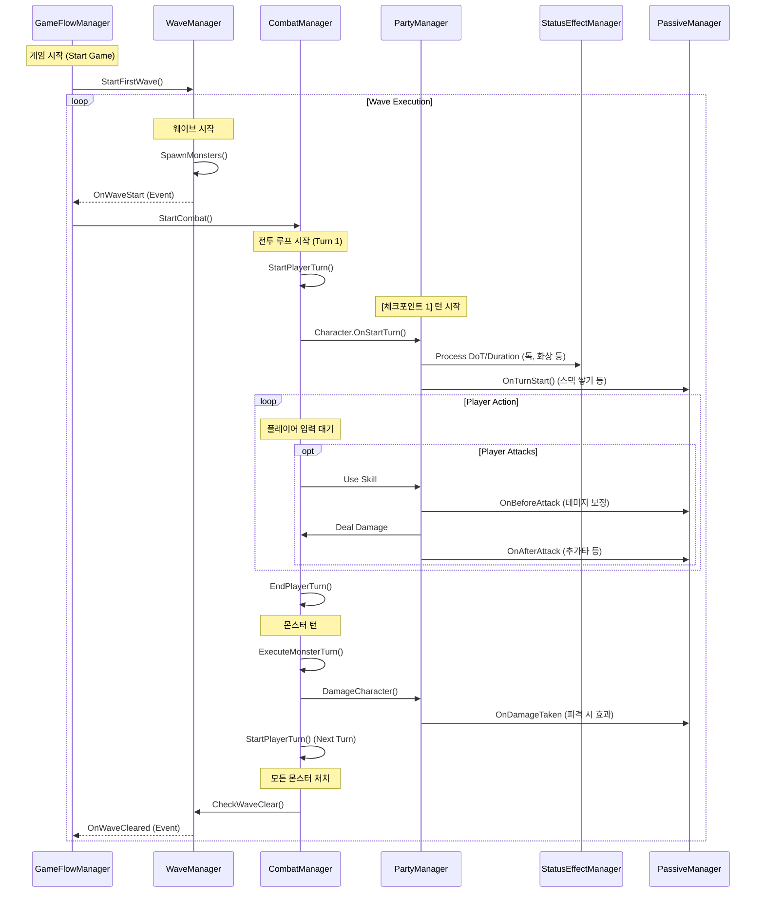

# 게임 전체 흐름도 (Game Flow Overview)

이 문서는 **Dice Orbit**의 게임 초기화부터 종료까지의 전체 흐름을 설명합니다. (TurnManager 통합 반영)

## 1. 매니저별 역할 및 흐름도 (Manager Responsibility Flow)

각 매니저가 어떤 영역을 담당하고, 서로 어떻게 연결되는지 보여주는 구조도입니다.

## 2. 매니저 상호작용 시퀀스 (Interaction Sequence)

시간 순서에 따른 매니저 간의 호출 흐름입니다.

## 3. 상세 시스템 동작 (Detailed Mechanics)

### A. 상태 이상 & 패시브 체크 시점
사용자의 질문대로 전투 중간중간 지속적으로 체크가 이루어집니다.

1.  **턴 시작 시 (`OnTurnStart`)**:
    *   **StatusEffectManager**: 지속시간 감소, 도트 데미지(독, 화상), 힐(재생) 적용.
    *   **PassiveManager**: 턴 시작 시 발동하는 패시브(예: `FocusStackPassive` 스택 증가) 처리.
2.  **공격 전 (`OnBeforeAttack`)**:
    *   **PassiveManager**: 데미지 계산 전에 개입하여 공격력을 증가시키거나 속성을 부여합니다. (예: `BattleCryPassive`, `PositioningPassive`)
3.  **이동 시 (`OnMove`)**:
    *   **PassiveManager**: 이동 거리에 따른 보너스를 계산합니다. (`StancePassive`, `PositioningPassive`)
4.  **피격 시 (`OnDamageTaken`)**:
    *   **PassiveManager**: 데미지를 입었을 때 발동하는 방어 기제나 반격 로직을 처리합니다.
