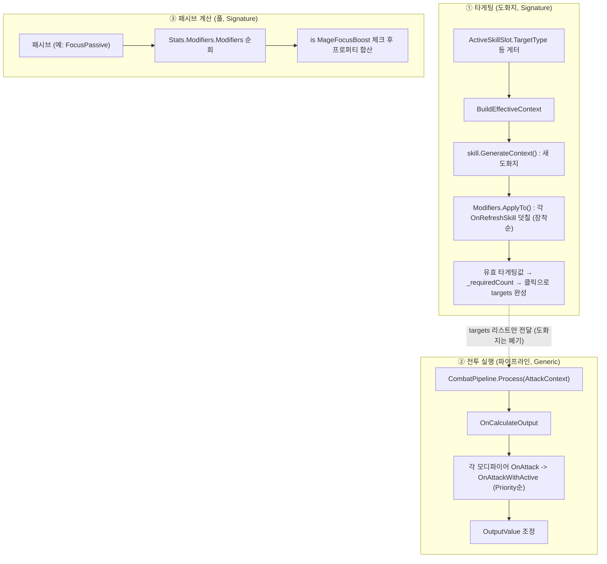

---

# 🛠️ 스킬 런타임 갱신 시스템 (Modifier) 개편 요약 가이드

## 1. 개편 배경 및 목적
기존의 모디파이어 시스템은 스킬의 구조(타겟팅 범위, 타겟 수, 고유 배율 등)를 변경할 때 **스킬의 런타임 인스턴스(RuntimeInstance) 자체를 직접 영구적으로 변형**하는 방식을 사용했습니다. 
이 방식은 모디파이어가 추가/제거될 때마다 수치를 수동으로 더하고 빼야 해서 복원(Revert) 로직의 오류 발생 위험(상태 불일치)이 컸습니다. 이를 해결하기 위해, 원본 스킬은 유지하면서 장착 시점에 **휘발성 데이터 컨텍스트를 새로 덧씌워 계산(Caching)하는 구조**로 개편했습니다.

---

## 2. 개편 전(Before) vs 개편 후(After) 비교

### ❌ [개편 전] `OnEquipped` / `OnUnequipped` 직접 수정 방식
기존에는 모디파이어 장착/해제 시점에 스킬 인스턴스의 타겟 수치를 직접 더하고 뺐습니다.
*   **문제점:** 복합적인 모디파이어가 겹쳤을 때, 적용 순서 꼬임 및 해제 시 원본 수치로 완벽하게 되돌리기(Revert) 까다로움.

```csharp
// 개편 전: GreatswordWideSwing (광역 참격) 
public override void OnEquipped(Character character)
{
    var ri = GetRuntime(character);
    ri.targetCount++; // 장착 시 직접 더함
    if (ri.targetCount > 1) ri.targetType = CharacterSkillTargetType.MultiEnemy;
}

public override void OnUnequipped(Character character)
{
    var ri = GetRuntime(character);
    ri.targetCount--; // 해제 시 직접 뺌 (버그 발생 위험)
}
```

### ✅ [개편 후] `OnRefreshSkill(CharacterModfierContext)` 도출 방식
모디파이어가 장착 또는 해제될 때처럼 스킬 상태 갱신이 필요하다면 원본 스킬을 기반으로 `CharacterModfierContext` 객체를 **새로 생성한 뒤 빈 도화지 위에 모디파이어 로직을 일괄 적용(덮어쓰기)** 합니다.
*   **장점:** 해제 시 원상복구(Revert) 코드를 짤 필요가 전혀 없습니다. `OnRefreshSkill` 한 곳에서 "더해질 값의 최종 형태"만 선언하면 시스템이 항상 새 컨텍스트로 계산을 보장합니다.

```csharp
// 개편 후: GreatswordWideSwing (광역 참격)
public override void OnRefreshSkill(CharacterModfierContext context)
{
    // C# 패턴 매칭(Downcasting)으로 전사 대검 스킬인지 안전하게 확인
    if (context is WarriorGreatswordModifiedContext gsContext)
    {
        // 뺄 필요 없이, 이 모디파이어가 적용될 때 수행할 조작만 명시
        gsContext.TargetCount += 1;
        gsContext.TargetType = CharacterSkillTargetType.MultiEnemy;
    }
}
```

---

## 3. 핵심 변경 요소 및 구조

1. **`CharacterModfierContext` 추가 (Base 클래스)**
   - 모든 스킬이 공유하는 핵심 데이터(`TargetType`, `TargetCount`, `PreviewStyle` 등)를 담는 객체입니다. 스킬 실행 전 타겟팅 범위를 그리는 UI 등에서 이 객체를 읽어갑니다.
   - CharacterModfierContext 대신 Skill에서 타겟팅 범위를 읽을 수 있게 수정할 예정입니다.

2. **강타입(Typed) 서브 컨텍스트 (Derived 클래스)**
   - 캐릭터 전용 기믹 수치를 저장하기 위해 Base를 상속받아 생성합니다. 
   - 예: `WarriorGreatswordModifiedContext`는 대검 전용 기믹인 `BaseDamageMultiplier` 프로퍼티를 추가로 보유합니다.
   - 이를 통해 광역 공격으로 변경 등을 처리할 수 있습니다.

3. **`ModifierManager.ApplyTo(CharacterModfierContext)` 추가**
   - `IModifierManager`/`ModifierManager`에 정의되어 있으며, 모디파이어 목록을 순회하며 `OnRefreshSkill`을 호출해 컨텍스트를 완성시키는 파이프라인 메서드입니다(`context.IsCancelled`가 참이면 중단). 명시적 새로고침 호출은 없으며, `ActiveSkillSlot`의 타게팅 게터가 읽힐 때마다 지연(lazy) 호출되어 항상 새로 계산됩니다 (§4.3 참고).

4. **`CharacterActiveSkill.GenerateContext()` 추가**
   - 원형(Template) 스킬 클래스가 자신의 초기 상태를 담은(Base 혹은 Derived) 컨텍스트를 생성하여 내보냅니다.

## 4. 현재 구조 상세 (Current Architecture)

> 위 개편이 **실제 반영된 현재 코드 기준** 동작이다. 새 모디파이어를 만들 때 이 절을 참고하면 된다.

### 4.1 모디파이어 적용 경로 3종
`ModifierCategory` enum은 `Signature`/`Generic` 두 갈래지만, **실제 적용 경로(메커니즘)는 3개**다.
게임 루프에서 모디파이어가 개입할 수 있는 순간이 3개이기 때문이다: 타게팅할 때(누굴 몇 명?), 때릴 때(얼마나 아프게?), 패시브가 계산할 때(스택 몇 개?).

| 경로 | Category | 무엇을 바꾸나 | 훅 | 예시 |
|---|---|---|---|---|
| **도화지** | Signature | 특정 스킬의 **타게팅 구조** (타겟 종류/수, 미리보기) | `OnRefreshSkill(CharacterModfierContext)` — 전용 컨텍스트로 다운캐스팅 후 조작 | `GreatswordWideSwing` (대검 대상 수 +1) |
| **파이프라인** | Generic | 모든 공격의 **결과 수치**(`OutputValue`) | `OnAttackWithActive(AttackContext)` — 파이프라인 리액터 훅(`OnCalculateOutput`) | `SharpBladeModifier`(+고정), `BerserkModifier`(+%), `GiantStrengthModifier` |
| **풀(pull)** | Signature | 대응 **패시브의 수치** (스택 획득량, 계수, 설치 수) | **훅 없음** — public 프로퍼티만 노출, 패시브가 장착 목록을 뒤져 직접 합산 | `MageFocusBoost`, `RoguePositioningBoost`, `AlchemistExtraReagent` |

> ⚠️ **풀 경로**는 `OnRefreshSkill`도 `OnAttack`도 쓰지 않는다. 컨텍스트/파이프라인 어디에도 등장하지 않는 수동적 데이터 홀더이고, 로직 주체는 패시브 쪽이다 (예: `FocusPassive.GetFocusStackBonus()`가 `Stats.Modifiers.Modifiers`를 순회하며 `is MageFocusBoost` 체크 후 프로퍼티를 읽어간다).

### 4.2 클래스 구성
- **`CharacterModifier`** (`Units/Character/Modifiers/CharacterModifier.cs`) — 추상 베이스이자 `ICombatReactor`. `ModifierName/Description/Icon/Category/Priority/owner` + 두 훅: `OnRefreshSkill`(구조 변경)과 `OnAttack`→`OnAttackWithActive`(수치 변경, `SourceUnit==owner && OnCalculateOutput`일 때만). 제시/장착 가능 여부는 `CanApplyTo(Character)`.
- **`ModifierManager : IModifierManager`** (`.../Modifiers/ModifierManager.cs`) — 캐릭터에 장착된 모디파이어 컨테이너. `Add/Remove/Modifiers`, `ApplyTo(ctx)`(장착 순서대로 `OnRefreshSkill` 일괄 적용, `ctx.IsCancelled` 시 중단), `CollectReactors(list)`(Generic 훅을 파이프라인 리액터로 등록).
- **`CharacterModfierContext`** (`Combat/Pipeline/CharacterModfierContext.cs`) — 스킬의 초기 타게팅값(`TargetType/TargetCount/PreviewStyle`)을 담는 "도화지". 생성자가 스킬의 기본값으로 채운다. 파생: `WarriorGreatswordModifiedContext`(전용 `BaseDamageMultiplier`, 기본 1). ⚠️ `BaseDamageMultiplier`는 현재 **미배선** — 정의만 있고 읽는/쓰는 곳이 없다(`CalculateRawDamage`는 자기 `multiplier` 필드만 사용). 향후 대검 배율 모디파이어용 자리.
- **`CharacterActiveSkill.GenerateContext(source, slot)`** — 스킬이 자기 초기 컨텍스트를 만든다. 기본은 `CharacterModfierContext`; 전용 기믹이 있으면 override해 파생 컨텍스트를 반환(예: `WarriorGreatswordActive`).
- **`ModifierRegistry`** (`Data/Modifiers/ModifierRegistry.cs`) — 보상 풀(정적 팩토리 배열). 보상은 `GetRandomChoicesForParty(party, count)`가 생존 파티원 중 1명이라도 `CanApplyTo`인 종류를 셔플해 **공용 3장**으로 제시하고(2026-10-03), 고른 대상에게 `ModifierManager.Add`로 장착된다. `CountOn(character, modifier)` = 같은 종류 장착 수(카드의 "중첩 n → n+1"). 계열(`ModifierFamily`: 위치/주사위/콤보/생존)은 보상 카드 아이콘·라벨용.

### 4.3 런타임 흐름 — 세 순간별 호출 경로

#### 0) 획득/장착 (계산 없음)
전투 보상에서 `RewardRoller` → `ModifierRegistry.GetRandomChoicesForParty(파티, N)`이 후보마다 생존 파티원에 `CanApplyTo`를 물어 제시 가능한 것만 거른다. 유저가 카드와 대상을 고르면 `Stats.Modifiers.Add(mod)` — **리스트에 넣을 뿐 이 시점엔 아무 수치도 안 바뀐다.**

> ⚠️ `CanApplyTo`(장착 가능 여부 확인, 보상 시점 1회)와 `ApplyTo`(컨텍스트 일괄 적용, 읽을 때마다)는 이름만 비슷한 **전혀 다른 메서드**다.

#### 1) 타게팅할 때 — 도화지 경로 (컨텍스트가 존재하는 유일한 경로)
`ApplyTo`를 명시적으로 부르는 코드는 어디에도 없다. `ActiveSkillSlot`(파일명 주의: `RuntimeAbility.cs`)의 **프로퍼티 게터 뒤에 숨어 있다**:

```
SkillTargetSelector / SkillManager / CharacterActionUI(툴팁)
 └─ slot.TargetType / TargetCount / PreviewStyle 읽음   ← "변수"처럼 보이지만 게터
     └─ BuildEffectiveContext()                          (RuntimeAbility.cs)
         ├─ skill.GenerateContext(Owner, slot)   ① 새 도화지 생성 (스킬이 자기 양식으로)
         └─ Modifiers.ApplyTo(ctx)               ② 장착 순서대로 전원 OnRefreshSkill
             └─ foreach mod → mod.OnRefreshSkill(ctx), IsCancelled 시 중단
```

- 컨텍스트는 **일회용**: 게터를 읽을 때마다 새로 만들고 버린다(캐싱 없음). 그래서 원본 스킬 인스턴스는 절대 변형되지 않고, 해제 시 원복(Revert) 코드도 필요 없다.
- `ApplyTo`는 아무도 거르지 않고 **전원에게** 컨텍스트를 돌린다. 거르는 건 각 모디파이어가 `is 전용컨텍스트` 체크로 스스로 한다(안 맞으면 조용히 패스, `OnRefreshSkill` 기본 구현은 빈 몸통).
- 같은 모디파이어 2개 장착 = 루프가 2번 돎 = **중첩이 공짜로 된다.**
- **적용 순서 = 장착 순서** (Priority 안 씀). 현재는 전부 `+=`라 순서 무관하지만, 곱셈 모디파이어가 생기면 순서 의존이 생긴다 — 그때 `ApplyTo`에 정렬을 추가할 것.
- 타게팅 결과: 모디파이어의 기여는 `_requiredCount` 숫자 하나로 굳어지고(`SkillTargetSelector.ResolveRequiredCount`), 플레이어의 클릭이 `_pendingUnits` 리스트를 그만큼 채운다.

#### 2) 때릴 때 — 파이프라인 경로 (컨텍스트 등장 안 함)
타게팅에서 만든 도화지는 이미 폐기됐고, 그 **결과물(클릭으로 채워진 `targets` 리스트)만** 전달된다:
`SkillTargetSelector.ConfirmAndExecute` → `SkillManager.ConfirmSkillExecution(source, slot, dice, units, tiles)` → `FinalExecutionRoutine` → `ability.Execute(source, targets, tiles, dice.Value)`.

**`Execute`는 도화지를 다시 만들지 않는다** — "누굴 때릴지"는 리스트로 굳어져 도착했고, "얼마나 아프게"는 파이프라인 몫이기 때문이다:

```
CharacterActiveSkill.Execute → 각 target마다 CombatPipeline.Process(AttackContext)
 ├─ CollectReactors: Character.CollectReactors → Modifiers.CollectReactors (모디파이어를 리액터로 등록)
 ├─ Priority 내림차순 정렬: 패시브(50~100) 먼저 → 모디파이어(10~30) 나중
 └─ OnCalculateOutput에서 각 모디파이어 OnAttack → OnAttackWithActive → OutputValue 조정
```

#### 3) 패시브가 계산할 때 — 풀 경로 (컨텍스트/파이프라인 모두 안 탐)
패시브가 자기 수치를 계산하는 시점에 장착 목록을 직접 뒤진다. 모디파이어는 가만히 앉아 있는 데이터 홀더:

```csharp
// FocusPassive.GetFocusStackBonus() — 패시브가 지갑을 직접 뒤짐
foreach (var m in ch.Stats.Modifiers.Modifiers)
    if (m is MageFocusBoost f) bonus += f.BonusFocusStacks;
```

#### 요약표

| | ① 타게팅 (누굴 몇 명?) | ② 때릴 때 (얼마나 아프게?) | ③ 패시브 계산 (스택 몇 개?) |
|---|---|---|---|
| 트리거 | `slot.TargetCount` 등 게터 읽기 | `CombatPipeline.Process` | 패시브가 필요할 때 직접 |
| 컨텍스트 | `CharacterModfierContext` 생성+적용 | 없음 (`AttackContext`는 별개 물건) | 없음 |
| 모디파이어 훅 | `OnRefreshSkill` | `OnAttackWithActive` | 훅 없음, 프로퍼티만 |
| 순서 | 장착 순서 | Priority 높은순 | 패시브 마음대로 |
| 예시 | 광역 참격 | 예리한 칼날 | 깊은 집중 |



### 4.4 세 경로 예시
```csharp
// ① 도화지: 대검 스킬의 '구조'를 바꿈 (GreatswordWideSwing)
public override void OnRefreshSkill(CharacterModfierContext context) {
    if (context is WarriorGreatswordModifiedContext gs) {   // 대검 전용 컨텍스트일 때만
        gs.TargetCount += 1;                                // 대상 수 +1 (도화지 위 조작)
        gs.TargetType   = CharacterSkillTargetType.MultiEnemy;
    }
}
public override bool CanApplyTo(Character c)                // 대검 보유자에게만 제시/장착
    => c?.Stats?.ActiveAbilities?.Any(s => s?.BaseSkill is WarriorGreatswordActive) ?? false;

// ② 파이프라인: 모든 공격의 '수치'를 바꿈 (SharpBladeModifier)
protected override void OnAttackWithActive(AttackContext context) {
    context.OutputValue += bonusDamage;                     // 파이프라인 OnCalculateOutput에서 가산
}

// ③ 풀: 패시브의 '수치'를 제공만 함 (MageFocusBoost) — 훅 없음
[SerializeField] private int bonusFocusStacks = 1;
public int BonusFocusStacks => bonusFocusStacks;            // FocusPassive가 장착 목록을 순회하며 읽어감
public override bool CanApplyTo(Character c)                // 정신 집중(FocusPassive) 보유자에게만 제시
    => c?.Stats?.PassiveInstances?.Any(p => p is FocusPassive) ?? false;
```

## 5. 작업자 적용 지침 (Action Item)

### 5.1 경로 선택 — 새 모디파이어가 바꾸는 게 뭔가?

```
새 모디파이어가 바꾸는 게 뭔가?
├─ 스킬의 대상 수/종류/미리보기    → ① 도화지 경로   (예: GreatswordWideSwing)
│    만들 것: (전용 수치가 있으면) 전용 Context + 스킬 GenerateContext override + OnRefreshSkill
├─ 공격 데미지/힐량                → ② 파이프라인 경로 (예: SharpBladeModifier)
│    만들 것: OnAttackWithActive override 하나면 끝
└─ 패시브의 수치                   → ③ 풀 경로       (예: MageFocusBoost)
     만들 것: public 프로퍼티 + 대응 패시브에 합산 코드(장착 목록 순회)

공통: CanApplyTo override(시그니처는 해당 스킬/패시브 보유자로 제한)
     + ModifierRegistry.Factories 배열에 한 줄 추가
```

### 5.2 도화지 경로 상세 단계
새로운 기믹을 지닌 캐릭터 스킬과 시그니처 모디파이어를 제작할 때는 다음 단계를 따른다.

*   스킬의 기초 데이터 이외에 모디파이어로 변경될 수 있는 전용 수치가 있다면, `CharacterModfierContext`를 상속받은 전용 컨텍스트(예: `MageFireballModifiedContext`)를 생성하세요.
*   `CharacterActiveSkill` 상속 클래스에서 `GenerateContext`를 _override_ 하여 해당 특수 컨텍스트를 반환하게 하세요.
*   모디파이어 스크립트에서는 기존의 `OnEquipped` 대신 **`OnRefreshSkill`**을 오버라이드하여 캐스팅(`if (context is 전용_컨텍스트_이름)`) 후 속성을 조작하시면 됩니다!
*   `OnRefreshSkill`은 게터를 읽을 때마다(프레임당 여러 번 가능) 반복 호출되므로 **순수하게 유지할 것** — 컨텍스트에 `+=`만 하고, 바깥 상태를 바꾸는 부수효과를 넣지 말 것.

### 5.3 풀 경로 상세 단계
패시브 수치를 강화하는 시그니처 모디파이어는 다음 단계를 따른다.

*   모디파이어에 `[SerializeField]` 수치 필드 + public 읽기 프로퍼티만 만든다. 훅은 오버라이드하지 않는다.
*   대응 패시브에 합산 헬퍼를 만든다: `owner.Stats.Modifiers.Modifiers`를 순회하며 `is 모디파이어타입` 체크 후 프로퍼티를 합산 (예: `FocusPassive.GetFocusStackBonus()`).
*   `CanApplyTo`에서 `Stats.PassiveInstances`에 대응 패시브가 있는지 확인해 보유자에게만 제시되게 한다.
