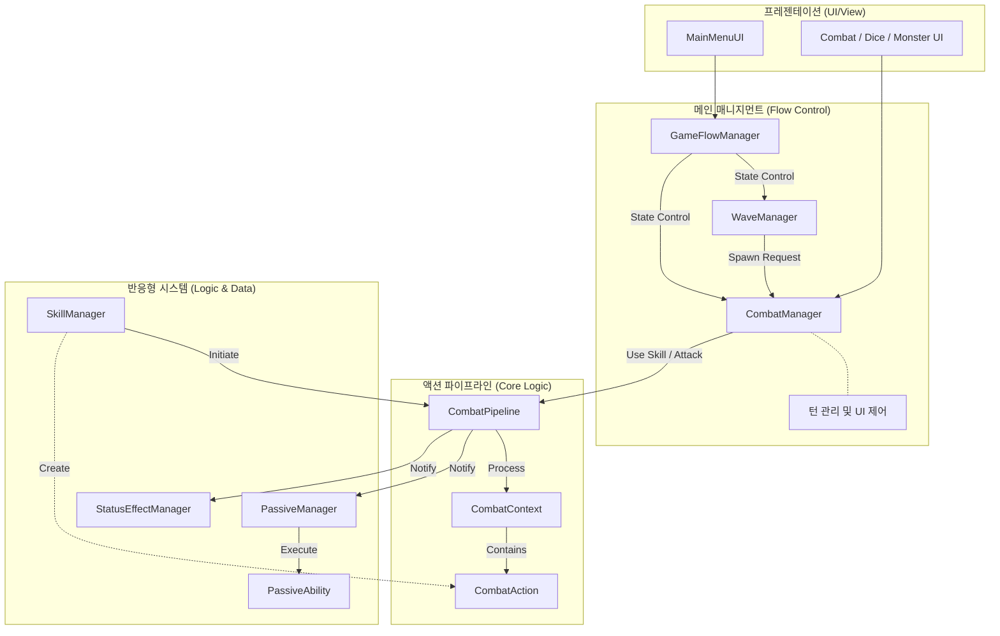

# 프로젝트 전체 구조 (Project Structure Overview)

Dice Orbit 프로젝트의 파일 구조와 시스템 아키텍처에 대한 개요입니다.

## 1. 폴더 구조 (Folder Structure)

주요 스크립트(`Assets/Scripts`)는 기능별로 다음과 같이 분류되어 있습니다.

```text
Assets/Scripts/
├── Core/               # 게임의 핵심 로직 및 매니저
│   ├── Managers        # GameFlow, Wave, Combat, Party, Skill 매니저 등
│   ├── Pipeline/       # [NEW] 전투 액션 파이프라인 (CombatPipeline, Context, Action)
│   ├── Units           # Character, Monster 등 기본 유닛 클래스
│   └── Logic           # Turn, Dice 등 핵심 메카닉
│
├── Data/               # 데이터 정의 (ScriptableObjects)
│   ├── Skills/         # 스킬 데이터 및 모듈
│   ├── Passives/       # 패시브 능력 데이터 (Reactive)
│   ├── Waves/          # 웨이브 구성 데이터
│   └── Characters/     # 캐릭터 스탯 정의
│
├── Systems/            # 특정 기능 구현을 위한 하위 시스템
│   ├── Effects/        # 상태 이상 (Status Effect) 처리
│   ├── Passives/       # 패시브 매니저 (PassiveManager)
│   └── Recruit/        # 영입 시스템 로직
│
├── UI/                 # 사용자 인터페이스
│   ├── MainMenu/       # 메인 메뉴
│   ├── Combat/         # 전투 UI (Dice, Attack Preview)
│   └── Popups/         # 데미지 플로팅, 보상 팝업 등
│
└── Visuals/            # 시각적 연출 (VFX 등)
```

## 2. 시스템 아키텍처 (System Architecture)

게임은 크게 **매니지먼트 계층**, **파이프라인 계층**, **반응형 시스템 계층**으로 나뉩니다.



## 3. 핵심 모듈 설명 (Core Modules)

### 매니저 (Core Layers)
*   **GameFlowManager**: 게임의 진입점. 메인 메뉴, 전투 진입, 승리/패배 상태를 전환하며 전체 흐름을 잡습니다.
*   **CombatManager**: **(턴 관리)** 전투의 턴 순서(Player <-> Monster)를 관리하고 UI를 제어합니다. 실제 전투 로직은 **Pipeline**에 위임합니다.

### 데이터 처리 (Pipeline Layer)
*   **CombatPipeline**: 전투에서 발생하는 모든 액션(공격, 힐, 버프)을 처리하는 엔진입니다. `CombatAction`을 받아 데미지를 계산하고 적용합니다.
*   **ICombatReactor**: 패시브나 효과가 파이프라인에 개입하기 위한 인터페이스입니다.

### 시스템 (System Layers)
*   **Skill System**: `SkillManager`가 스킬 사용을 준비하고, `CombatAction`을 생성하여 파이프라인으로 보냅니다.
*   **Passive System**: `PassiveManager`가 `ICombatReactor`를 구현하여, 전투 중 발생하는 이벤트에 실시간으로 반응합니다.
*   **Effect System**: `StatusEffectManager`가 버프/디버프를 관리하며 파이프라인 로직에 참여합니다.
