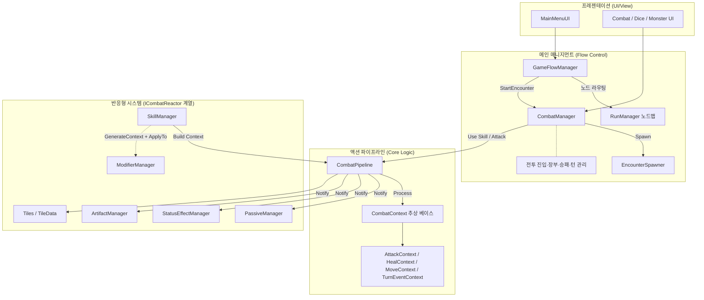

# 프로젝트 전체 구조 (Project Structure Overview)

Dice Orbit 프로젝트의 파일 구조와 시스템 아키텍처에 대한 개요입니다.
(Unity 6000.3 기준, 2026-08-01 갱신 — Artifact 재구축 · ActionType 제거 · WaveManager 폐지 · 세이브 시스템 v2(참가자 방식) 반영.)

## 1. 폴더 구조 (Folder Structure)

주요 스크립트(`Assets/Scripts`)는 다음과 같이 분류되어 있습니다. `Core`는 스테이지 단위로 깊게 중첩되어 있으며, 전투 시스템 전체가 `Core/Stage/BattleStage/BattleStageSystem/Combat` 아래에 모여 있습니다. (`Systems/`, `Core/Managers`, `Core/Pipeline`, `Core/Logic` 폴더는 **존재하지 않습니다.**)

```text
Assets/Scripts/
├── Core/                                    # 게임 진입점 및 핵심 로직
│   ├── CharacterSpawner.cs                  # 캐릭터 스폰 (런타임 Animator AddComponent)
│   ├── GameFlowManager.cs                   # 게임 흐름(메뉴/맵/전투/보상) 상태 전환 + 노드 라우팅
│   ├── GameManager.cs / GameState.cs        # 전역 매니저 / 상태 enum
│   ├── GoldManager.cs                       # 재화 관리
│   ├── Run/                                 # === 런(노드맵) 구조 — run_structure_system.md ===
│   │   ├── RunManager.cs                    # 런 상태 단일 권위 (막/맵/현재 노드/시드)
│   │   ├── MapGraph.cs / MapGenerator.cs    # 노드맵 그래프 + 생성 (비례 창 매핑)
│   │   ├── ActDefinition.cs                 # 막 에셋: 층 구성 + 티어/엘리트/보스 풀 + 기본 배경
│   │   ├── EncounterDefinition.cs           # 전투 1회 몹 세트 (구 WaveDefinition)
│   │   ├── Artifact/                        # 유물: ArtifactData(SO) + RuntimeArtifact + ArtifactManager
│   │   ├── PotionDefinition/PotionManager   # 포션 3슬롯
│   │   ├── EventDefinition.cs               # 다중 선택지 이벤트 SO
│   │   └── Save/                            # 런 세이브 v2 (7개 파일) — RunSaveService는 오케스트레이션만(고정 참가자 목록 순회, DiceOrbit.Core.Run.Save), 실제 저장/복원은 각 매니저가 IRunSaveParticipant(Capture/Validate/Apply)로 직접 수행. 에셋 조회는 SaveIdCatalog의 불변 saveId(표시 이름 아님). 마이그레이션 없음(v1 폐기). **필수 에셋: `Assets/Resources/SaveIdCatalog.asset`** — 런타임이 `Resources.Load`로 이 경로만 찾으므로, 없거나 다른 폴더에 있으면 복원이 통째로 실패한다
│   └── Stage/
│       ├── PartyManager.cs                  # 파티(플레이어 캐릭터) 관리
│       └── BattleStage/
│           ├── BattleStageSystem/           # 전투 스테이지의 모든 시스템
│           │   ├── CombatManager.cs*        # (*Combat/ 하위) 턴 관리
│           │   ├── OrbitManager.cs          # 원형 궤도 보드 / Tiles
│           │   ├── EncounterSpawner.cs      # 몹 세트 스폰 전용 도구 (구 WaveManager 폐지, 2026-07-21)
│           │   ├── CenterZone.cs, Background/Debug Manager
│           │   ├── Combat/                  # === 전투 파이프라인 & 반응형 시스템 ===
│           │   │   ├── Pipeline/            # CombatPipeline, CombatContext, CombatAction, ICombatReactor, CharacterModfierContext
│           │   │   ├── Passive/             # IPassive, PassiveManager, CharacterPassive, PassiveAbility
│           │   │   ├── Effects/             # StatusEffect, StatusEffectManager, BasicEffect
│           │   │   ├── Skills/              # CharacterActiveTemplate, RuntimeAbility, (tombstones)
│           │   │   ├── SkillData/           # SkillData
│           │   │   ├── CombatManager.cs, SkillManager.cs, SkillTargetSelector.cs
│           │   │   ├── ActionQueueManager.cs, EffectData.cs
│           │   ├── Dices/                   # DiceData, DiceManager, DiceRequirement
│           │   └── Tile/                    # TileData, TileAttribute
│           └── Units/                       # 유닛 계층
│               ├── Unit.cs, UnitStats.cs
│               ├── Character/               # Character, CharacterPreset, Stats, Selector, Progression
│               │   └── Modifiers/           # CharacterModifier, ModifierManager
│               └── Monster/                 # Monster, MonsterStats, MonsterAI, MonsterSkill, Preset ...
│
├── Data/                                    # 데이터 정의 및 콘텐츠 (SerializeReference / SO)
│   ├── Artifacts/                           # 유물 콘텐츠: 유물 1개 = 폴더 1개 (RuntimeArtifact 파생 클래스 + .asset)
│   ├── Character Preset/                    # 클래스별 액티브/패시브 (Warrior/Rogue/Alchemist/Mage)
│   ├── Modifiers/                           # 스킬 강화 모디파이어 (Generic/Warrior/Rogue/Mage/Alchemist) + ModifierRegistry
│   ├── MonsterAI/                           # AI 패턴 (Patterns/)
│   ├── MonsterPresets/                      # 웨이브별 몬스터 프리셋 (Wave1~Wave4)
│   └── Waves/                               # WaveSpawnPoint (스폰 지점 마커 — WaveDatabase는 Act 풀로 이관 후 삭제)
│
├── Editor/                                  # 커스텀 인스펙터 (CharacterPresetEditor, MonsterPresetEditor)
│                                            # + SaveIdValidator(카탈로그 재스캔·빈 saveId 백필·중복 검출, 메뉴 「도구/Dice Orbit/세이브 ID 전체 점검」)
│                                            # + SaveIdCatalogPostprocessor(에셋 임포트 시 재스캔 자동 호출)
│
├── Legacy/                                  # (비어 있음 - EMPTY, 파일 없음)
│
├── UI/                                      # 사용자 인터페이스
│   # MainMenuUI, DiceUI, CharacterActionUI, RecruitUI, CombatNotifier, FloatingLabelPopup ...
│   # 런 화면: NodeMapUI, ShopUI, EventUI, RewardUI, RunHudUI (에디터 소유 + 런타임 폴백 패턴)
│   # 정보 패널: InfoPanel/ (battle_info_panel_system.md)
│
└── Visuals/                                 # 시각적 연출 (VfxManager, CombatVfxProfile, TileVisual ...)
```

## 2. 시스템 아키텍처 (System Architecture)

게임은 크게 **매니지먼트 계층**, **파이프라인 계층**, **반응형 시스템 계층**으로 나뉩니다. 전투의 핵심은 `CombatPipeline`이 다양한 `CombatContext`(추상 베이스)를 처리하고, `ICombatReactor` 구현체들이 타입별(DIM) 훅으로 개입하는 구조입니다.


```mermaid
graph TD
    %% --- Layer Definitions ---
   subgraph Presentation["프레젠테이션 (UI/View)"]
        MainMenuUI
        CombatUI[Combat / Dice / Monster UI]
    end

    subgraph Management ["메인 매니지먼트 (Flow Control)"]
        GFM[GameFlowManager]
        RM[RunManager 노드맵]
        CM[CombatManager]
        ES[EncounterSpawner]
        NoteCM[전투 진입·장부·승패·턴 관리]
    end

    subgraph Pipeline ["액션 파이프라인 (Core Logic)"]
        ActionPipe[CombatPipeline]
        Context[CombatContext 추상 베이스]
        Sub[AttackContext / HealContext / MoveContext / TurnEventContext]
    end

    subgraph Reactors ["반응형 시스템 (ICombatReactor 계열)"]
        SysPassive[PassiveManager]
        SysStatus[StatusEffectManager]
        SysArtifact[ArtifactManager]
        SysTile[Tiles / TileData]
        SysMod[ModifierManager]
        SysSkill[SkillManager]
    end

    %% --- Connections ---

    %% Presentation -> Management
    MainMenuUI --> GFM
    CombatUI --> CM

    %% Management Internal
    GFM -->|노드 라우팅| RM
    GFM -->|StartEncounter| CM
    CM -->|Spawn| ES
    CM -.- NoteCM

    %% Manager -> Pipeline
    CM -->|Use Skill / Attack| ActionPipe
    SysSkill -->|Build Context| ActionPipe

    %% Pipeline Process
    ActionPipe -->|Process| Context
    Context --> Sub

    %% Pipeline -> Reactors (NotifyReactors)
    ActionPipe -->|Notify| SysPassive
    ActionPipe -->|Notify| SysStatus
    ActionPipe -->|Notify| SysArtifact
    ActionPipe -->|Notify| SysTile

    %% Skill prep uses Modifiers
    SysSkill -.->|GenerateContext + ApplyTo| SysMod
```

## 3. 핵심 모듈 설명 (Core Modules)

### 매니저 (Core Layers)
*   **GameFlowManager**: 게임의 진입점. 메인 메뉴, 전투 진입, 승리/패배 상태를 전환하며 전체 흐름을 잡습니다.
*   **CombatManager**: **전투 상태의 단일 권위** (2026-07-21 정리). 진입점 `StartEncounter(EncounterDefinition, 층번호)` — 이전 몬스터 파괴 → `EncounterSpawner.Spawn` → 장부 등록 → `EventPhase.CombatStart` 파이프라인 방송 → 턴 시퀀스. 승패 판정은 `IsCombatFinished()` 한 곳이며, 결과는 `GameFlowManager.OnEncounterCleared()`/`OnCombatDefeat()` 직접 호출로 통지. 턴 순서(Player ↔ Monster)·UI 제어·전투 시작 방송(`OnCombatStart`)도 담당. 실제 데미지/효과 로직은 **CombatPipeline**에 위임합니다. 타일 지속시간 틱은 CombatManager 내부에서 직접 호출됩니다(파이프라인 브로드캐스트가 아님).
*   **EncounterSpawner**: 몹 세트 스폰 전용 도구 (인스턴스화·프리셋 초기화·위치 배치·정체성 색). 장부/판정/이벤트 없음.

### 파이프라인 (Pipeline Layer)
*   **CombatContext** (`Combat/Pipeline/CombatContext.cs`): **추상 베이스**입니다. 공통 필드로 `SourceUnit`, `Target`, `IsCancelled`, `IsSimulation`을 가집니다. (`ActionType Type` shim은 2026-07-21 제거됨.)
    *   `EffectContext`(Name/BaseValue/OutputValue/Tags/Effects) → `AttackContext`(+`IsEffected`), `HealContext`
    *   `MoveContext`(Steps), `TurnEventContext`(`EventPhase Phase`; enum = `TurnStart`/`TurnEnd`/`TileTick`/`CombatStart`)
*   **CombatAction** (`Combat/Pipeline/CombatAction.cs`): 클래스가 **CombatContext로 병합**되었고, `ActionType` enum도 2026-07-21에 삭제되어 이제 `struct ActionEffectInfo`만 남았습니다.
*   **CombatPipeline** (`Combat/Pipeline/CombatPipeline.cs`): `Instance.Process(CombatContext)`가 **PreAction → Calculate(`OnCalculateOutput`) → Apply → Post(`OnHit`, `OnPostAction`)** 순으로 실행됩니다. `CombatTrigger` enum은 정확히 `{ OnPreAction, OnCalculateOutput, OnHit, OnPostAction }` 뿐이며, 턴 이벤트는 트리거가 아니라 `TurnEventContext`+`EventPhase`로 전달됩니다. `NotifyReactors`가 소스/타겟 패시브, 파티 전체 패시브, 상태 효과, 유물(ArtifactManager), 타일(OrbitManager.Tiles/TileData)로부터 리액터를 수집합니다. 데미지/힐은 `Unit.TakeDamage/Heal`로 바로 적용되고, 상태/버프/디버프/DoT는 `StatusEffectManager.CreateEffect`+`AddEffect`로 처리됩니다.
*   **ICombatReactor** (`Combat/Pipeline/ICombatReactor.cs`): **DIM(default interface method)** 방식. 기본 `OnReact(trigger, context)`가 컨텍스트 구체 타입에 따라 타입별 훅(`OnAttack`/`OnHeal`/`OnMove`/`OnTurnEvent`)으로 분기합니다. 단순 리액터는 필요한 훅만 override하고, 전파형 리액터(PassiveManager/StatusEffectManager/TileData)는 `OnReact` 자체를 override합니다. 상세: `Docs/combat_reactor_dispatch.md`.

### 반응형 시스템 계열 (Reactor Families)
5개 계열이 모두 `ICombatReactor`를 구현합니다: **패시브 / 상태효과 / 유물 / 타일 / 모디파이어**.
*   **Passive System** (`Combat/Passive/`): `CharacterPassiveSkill : IPassive`(캐릭터 패시브), `PassiveAbility : IPassive`(몬스터 패시브) 모두 `[Serializable]` 추상 클래스이며 타입별 훅을 사용합니다(ScriptableObject 아님). `IPassive : ICombatReactor`. `PassiveManager`가 리액터로서 소속 패시브에 이벤트를 전파합니다. ⚠️ 파생 클래스 훅은 반드시 `override` — 베이스가 virtual 훅을 선언하며, `public void` 선언은 절대 호출되지 않습니다 (`combat_reactor_dispatch.md` §4.1).
*   **Effect System** (`Combat/Effects/`): `StatusEffect`는 타입별 DIM 훅을 사용하며, 지속시간은 **턴 시작 시**(`OnTurnEvent`에서 `Phase==TurnStart`) 감소합니다. `StatusEffectManager`가 `CreateEffect`/`AddEffect`와 만료 정리(TurnStart)를 담당합니다. `EffectType` enum은 `EffectData.cs`에 있습니다.
*   **Artifact System** (`Core/Run/Artifact/`, 콘텐츠 `Data/Artifacts/`): 유물 1개 = `RuntimeArtifact` 서브클래스 1개. `ArtifactData`(SO)가 표시 데이터 + SubclassPicker 프로토타입을 들고, 획득 시 `CreateInstance`로 런타임 인스턴스 복제. 보유 인스턴스 자체가 리액터라 `ArtifactManager.Artifacts`를 파이프라인이 그대로 수집합니다(Priority 11). 규칙형 효과(상점할인 등)는 질의 프로퍼티, 전투 행위(생명의 부적 회복 등)는 파이프라인 훅. 상세: `run_structure_system.md` §3-⑥.
*   **Tile System** (`BattleStageSystem/Tile/`): `TileData : ICombatReactor`가 `Dictionary<TileAttributeType, TileAttribute>`를 순회하며 `OnReact`를 속성으로 전달합니다. `TileAttribute` 기본 훅은 `OnReact/OnArrive/OnTraverse/OnEndTurn` + `SetOwner/TickDuration`. 지속시간은 `TickTurnEnd`로 처리됩니다.
*   **Modifier System** (`Units/Character/Modifiers/`, `Data/Modifiers/`): 컨텍스트 베이스는 `CharacterModfierContext`(철자 주의: *Modfier*)입니다. `CharacterModifier`는 추상 `ICombatReactor`이며 `OnRefreshSkill(CharacterModfierContext)`를 override합니다. `ModifierManager.ApplyTo(ctx)`가 모디파이어들의 `OnRefreshSkill`을 순회하며 `IsCancelled`에서 멈춥니다. 흐름: `ActiveSkillSlot`이 `skill.GenerateContext(...)` 후 `Modifiers.ApplyTo(ctx)`를 호출.

### 스킬 (Skills)
*   **CharacterActiveSkill** (`Combat/Skills/CharacterActiveTemplate.cs`): `[Serializable]` **추상 클래스**(SerializeReference, ScriptableObject 아님). `Execute/CalculateRawDamage/BuildPreview/Clone`을 제공하고 `[SerializeField] CombatVfxProfile vfxProfile`를 보유. `CharacterSkillTargetType`(OneEnemy/OneAlly/MultiEnemy/... /AllTiles) enum 포함.
*   **ActiveSkillSlot** (`Combat/Skills/RuntimeAbility.cs`): `BaseSkill`(SerializeReference) + `CurrentLevel` + `RuntimeInstance`. 액티브 전용. (`RuntimeAbility`라는 클래스명은 없음.)
*   **SkillManager** (`Combat/SkillManager.cs`): 진입점은 `PrepareSkill(Character, skillIndex, DiceData)`. `SkillTargetSelector`로 대상 선택 또는 즉시 `ActionQueue` 등록. (`ExecuteSkill` 메서드 없음.)
*   **SkillTargetSelector**: 커서/확정 라인은 시전자 기준 **방사형(radial)**. 데미지 미리보기 툴팁은 OneEnemy/MultiEnemy에만. 타일 타겟은 `TileSkillPreviewManager` + `PreviewStyle` 사용.
*   *(제거됨/tombstone: `CharacterSkillBase`, `PassiveSkillAsset`, `SkillAsset`, `CharacterSkill`, `SkillLevelData`, `EffectManager`, `IEffect` 등은 존재하지 않습니다.)*

### 콘텐츠 (Data)
*   **캐릭터**: 정확히 4개 — Warrior/Rogue/Alchemist/Mage (`Data/Character Preset/<Class>/`).
    *   액티브: WarriorGreatswordActive, MageEnergyBallActive, RogueAmbushActive, AlchemistThrowActive
    *   패시브: BattleCryPassive(Warrior), FocusPassive(Mage), PositioningPassive(Rogue), ReagentPrepPassive(Alchemist)
    *   (Meteorologist/Scout/StableReactionPassive/ScoutingPassive 등은 없음.)
*   **CharacterPreset**: `[SerializeReference]` 리스트 **2개** — `StartingActives`(List&lt;CharacterActiveSkill&gt;), `StartingPassives`(List&lt;CharacterPassiveSkill&gt;). (통합 `StartingSkills` 없음.) `ModifierContextTypeName` 필드로 SerializeReference 컨텍스트 타입을 연결.
*   **모디파이어**: `Generic/Warrior/Rogue/Mage/Alchemist` 폴더 + `ModifierRegistry.GetRandomChoicesFor(character, count)`.

### 연출 및 알림 (Visuals / Notifications)
*   **VFX** (`Assets/Scripts/Visuals/`): `CombatVfxProfile`(SO) + `VfxManager`(PlayCast/PlayHit/PlayHeal/PlayTile 등). `vfxProfile`는 `CharacterActiveSkill`에 있고, VFX는 `Execute` 내부에서 인라인 재생됩니다(PlayCast → 대상별 AttackContext → 파이프라인 → PlayHit). 커스텀 VFX 억제는 `context.AddTag("CustomVfx")` 태그로 처리. 프로필은 `Assets/Resources/Skill/VFX/`.
*   **알림/툴팁**: `FloatingLabelPopup`(월드 공간), `CombatNotifier`(NotifyStatus/NotifyPassive + 스태거), `HoverTooltipUI` + `GlossaryContainerUI` + `TooltipKeywordDatabase` + `IHoverTooltipProvider`(Character/Monster/TileData).
