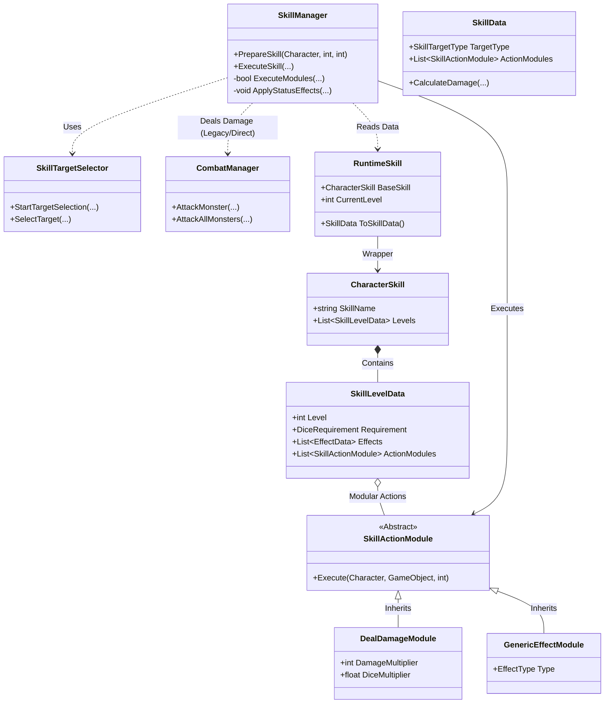
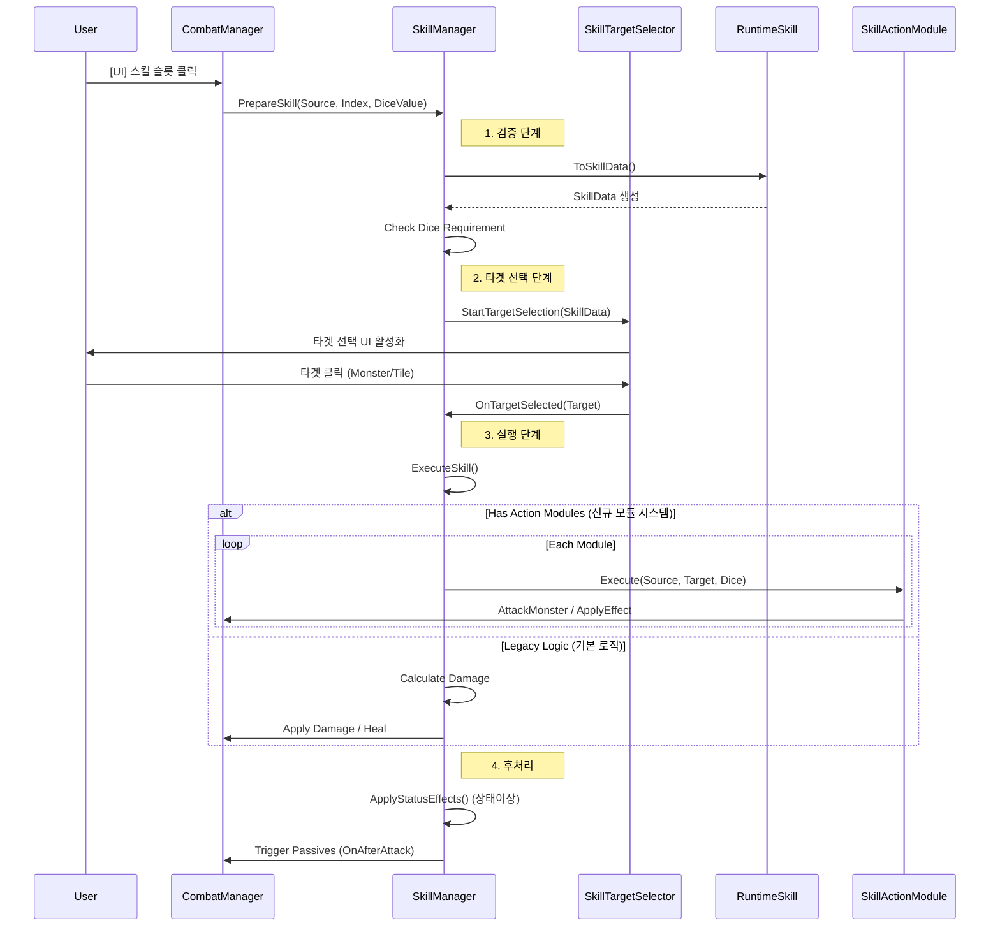

# 스킬 시스템 구조도 (Skill System Structure)

이 문서는 **Dice Orbit**의 캐릭터 스킬 시스템 구조와 실행 흐름을 상세히 설명합니다.

## 1. 클래스 구조도 (Class Architecture)

## 2. 스킬 실행 흐름도 (Execution Flow)

스킬을 선택하고 실행될 때까지의 내부 처리 과정을 보여줍니다.

## 3. 주요 컴포넌트 설명 (Component Details)

### A. Core Components
*   **SkillManager**: 스킬 시스템의 총괄 관리자입니다.
    *   `PrepareSkill`: 주사위 조건 검사 및 타겟 선택 요청.
    *   `ExecuteSkill`: 최종적으로 모듈을 실행하거나 직접 데미지를 입힙니다.
*   **SkillTargetSelector**: 타겟팅(단일 적, 아군, 전체 등) 모드에 따라 마우스 입력을 처리합니다.

### B. Data & State
*   **CharacterSkill (SO)**: 변하지 않는 스킬의 정의(이름, 레벨별 데이터)입니다.
*   **RuntimeSkill (C# Class)**: 인게임에서 레벨업 상태를 저장하고, 현재 레벨에 맞는 `SkillData`를 생성합니다.
*   **SkillActionModule (SO)**: 스킬의 행동을 조립식으로 정의합니다. (예: "투사체 발사", "광역 폭발", "도트뎀 부여"를 모듈로 붙일 수 있음)

### C. 확장성 (Extensibility)
기존의 하드코딩된 로직(`ExecuteSkill` 내부의 switch문)보다 **Action Module**을 사용하는 것이 권장됩니다. 모듈을 사용하면 **CharacterSkill** 에셋에서 원하는 모듈을 리스트에 추가하는 것만으로 새로운 스킬 로직을 만들 수 있습니다.
