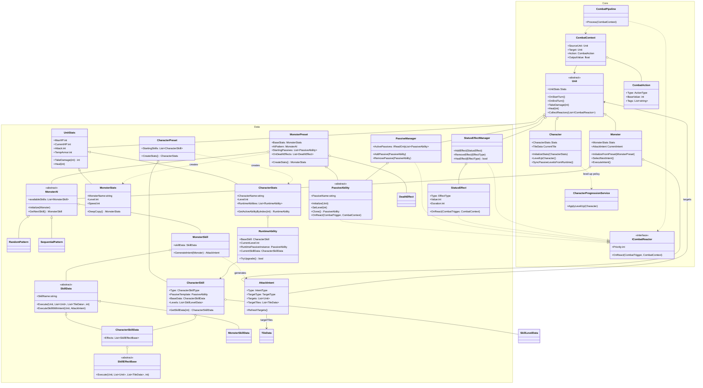
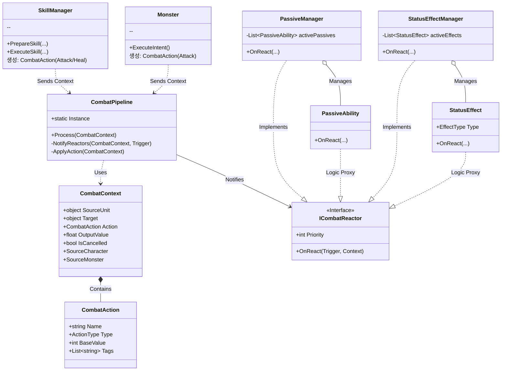
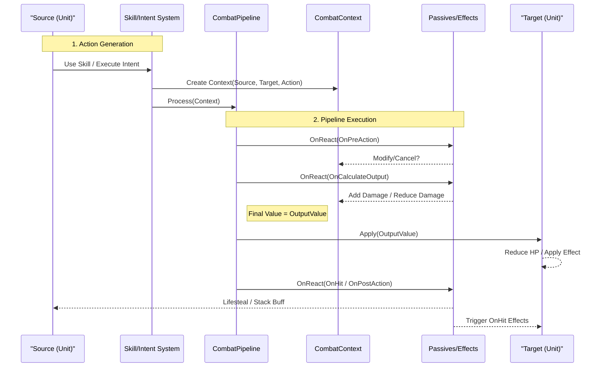

# Dice-Orbit Combat Domain Class Diagram

부제: Combat & Skill Service Architecture

이 문서는 **Action Pipeline** 패턴이 적용된 Dice Orbit의 전투 시스템을 설명합니다. 스킬, 패시브, 상태이상(Effect)이 하나의 파이프라인으로 통합되어 처리됩니다.

## 1. 시스템 아키텍처 (System Architecture)

전투 시스템은 **요청(Action Generation)**, **처리(Pipeline Processing)**, **반응(Reactive System)**의 3단계로 구성됩니다.

### 1.1 Combat Domain Class Diagram (Current)

아래 다이어그램은 레거시 `RuntimeSkill`/캐릭터 `StartingPassives` 제거 이후 구조를 반영합니다.

## 2. 전투 실행 흐름 (Execution Flow)

모든 전투 행위(스킬, 몬스터 공격, 도트 데미지 등)는 `CombatPipeline`을 통과합니다.

### 2.1 전체 파이프라인 순서
1.  **Preparation**: 액션 생성 및 타겟 설정 (`CombatContext` 생성)
2.  **Pre-Action**: 액션 시작 전 단계 (취소, 회피 판정 등)
3.  **Calculation**: 수치 계산 단계 (데미지 공식, 버프/디버프 연산)
4.  **Application**: 실제 적용 (HP 감소, 힐 적용)
5.  **Reaction**: 적용 후 반응 (피격 시 효과, 흡혈, 처치 효과)

### 2.2 상세 시퀀스 다이어그램

## 3. 데이터 구조 (Data Structure)

*   **SkillData**: 런타임 스킬 정보. `ActionModules`를 포함하여 파이프라인을 타기 전 동작을 정의.
*   **PassiveAbility (SO)**: 패시브 로직 정의. `ICombatReactor`처럼 동작하며 특정 트리거에 반응.
*   **StatusEffect (Class)**: 런타임 버프/디버프. 자신이 부착된 유닛이 Source/Target이 될 때 `OnReact`를 통해 결과에 개입.

### 예시: 데미지 계산 공식
`OutputValue` = (`BaseDamage` + `DiceBonus`)
-> **Reactor 1 (Passive)**: `OnCalculateOutput` -> `OutputValue += 5` (공격력 증가)
-> **Reactor 2 (Target Defense Effect)**: `OnCalculateOutput` -> `OutputValue -= 2` (방어력 증가)
-> **Final Applied**: `Base + Dice + 5 - 2`
