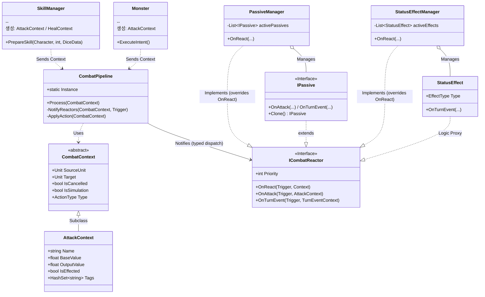
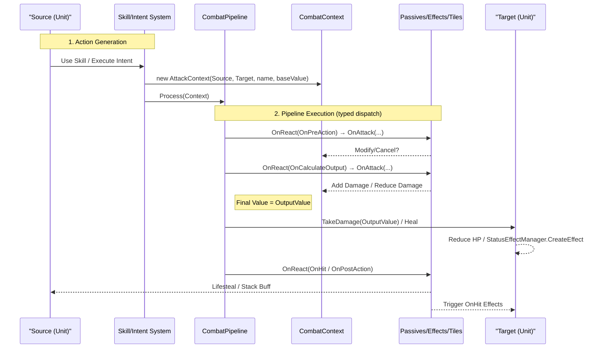

# Dice-Orbit Combat Domain Class Diagram

부제: Combat & Skill Service Architecture

이 문서는 **Action Pipeline** 패턴이 적용된 Dice Orbit의 전투 시스템을 설명합니다. 스킬, 패시브, 상태이상(Effect)이 하나의 파이프라인으로 통합되어 처리됩니다.

## 1. 시스템 아키텍처 (System Architecture)

전투 시스템은 **요청(Action Generation)**, **처리(Pipeline Processing)**, **반응(Reactive System)**의 3단계로 구성됩니다.

### 1.1 Combat Domain Class Diagram (Current)

> **주요 설계 원칙**
> - `CombatContext` → **추상 베이스**. `SourceUnit`/`Target`/`IsCancelled`/`IsSimulation`/`Type`(마이그레이션 shim)만 보유. 파이프라인이 나르는 "봉투".
> - 구체 컨텍스트는 서브클래스로 분화: `EffectContext`(→ `AttackContext`/`HealContext`), `MoveContext`, `TurnEventContext`. (구 `CombatAction` 객체는 `CombatContext`로 **병합**되어 더 이상 존재하지 않음)
> - `CharacterActiveSkill`, `CharacterPassiveSkill` → 각각 **독립된** `[Serializable]` 추상 클래스 (SO 아님, `[SerializeReference]` 인라인). 공통 베이스(`CharacterSkillBase`)는 **제거됨**.
> - `CharacterPreset` → `StartingActives`(`List<CharacterActiveSkill>`)와 `StartingPassives`(`List<CharacterPassiveSkill>`)의 **두 개** `[SerializeReference]` 리스트로 분리.
> - `PassiveAbility` → `[Serializable]` 유지 (몬스터 전용 인라인 패시브). `CharacterPassiveSkill`과 함께 `IPassive` 구현.
> - `ICombatReactor` → **DIM(default interface method)**. 기본 `OnReact`가 컨텍스트 구체 타입으로 디스패치하고, 리액터는 필요한 타입 훅(`OnAttack`/`OnHeal`/`OnMove`/`OnTurnEvent`)만 구현.

```mermaid
classDiagram
direction TB

namespace Core {
    class Unit {
        <<abstract>>
        +UnitStats Stats
        +OnStartTurn()
        +OnEndTurn()
        +TakeDamage(int)
        +Heal(int)
        +CollectReactors(List~ICombatReactor~)
    }

    class Character {
        +CharacterStats Stats
        +TileData CurrentTile
        +InitializeStats(CharacterStats)
        +LevelUpCharacter()
        +SyncPassiveLevelsFromRuntime()
    }

    class Monster {
        +MonsterStats Stats
        +AttackIntent CurrentIntent
        +InitializeFromPreset(MonsterPreset)
        +SelectNextIntent()
        +ExecuteIntent()
    }

    class CharacterProgressionService {
        +ApplyLevelUp(Character)
    }

    class CombatPipeline {
        +static Instance
        +Process(CombatContext)
    }

    class CombatContext {
        <<abstract>>
        +Unit SourceUnit
        +Unit Target
        +bool IsCancelled
        +bool IsSimulation
        +ActionType Type
    }

    class EffectContext {
        <<abstract>>
        +string Name
        +float BaseValue
        +float OutputValue
        +HashSet~string~ Tags
        +List~ActionEffectInfo~ Effects
        +AddTag(string)
        +HasTag(string) bool
        +AddEffect(EffectType, int, int)
    }

    class AttackContext {
        +bool IsEffected
    }

    class HealContext

    class MoveContext {
        +int Steps
    }

    class TurnEventContext {
        +EventPhase Phase
    }

    class ICombatReactor {
        <<interface>>
        +int Priority
        +OnReact(CombatTrigger, CombatContext)
        +OnAttack(CombatTrigger, AttackContext)
        +OnHeal(CombatTrigger, HealContext)
        +OnMove(CombatTrigger, MoveContext)
        +OnTurnEvent(CombatTrigger, TurnEventContext)
    }
}

namespace Data {
    class UnitStats {
        +MaxHP:int
        +CurrentHP:int
        +Attack:int
        +TempArmor:int
        +TakeDamage(int) int
        +Heal(int)
    }

    class CharacterStats {
        +CharacterName:string
        +Level:int
        +ActiveAbilities: List~ActiveSkillSlot~
        +PassiveInstances: List~CharacterPassiveSkill~
        +GetActiveAbilityByIndex(int) ActiveSkillSlot
    }

    class MonsterStats {
        +MonsterName:string
        +Level:int
        +Speed:int
        +DeepCopy() MonsterStats
    }

    class CharacterPreset {
        <<ScriptableObject>>
        +StartingActives: List~CharacterActiveSkill~ SerializeReference
        +StartingPassives: List~CharacterPassiveSkill~ SerializeReference
        +ModifierContextTypeName:string
        +CreateStats() CharacterStats
    }

    class MonsterPreset {
        +BaseStats: MonsterStats
        +AIPattern: MonsterAI
        +StartingPassives: List~PassiveAbility~
        +OnDeathEffects: List~DeathEffect~
        +CreateStats() MonsterStats
    }

    class MonsterAI {
        <<abstract>>
        +availableSkills: List~MonsterSkill~
        +Initialize(Monster)
        +GetNextSkill() MonsterSkill
    }

    class RandomPattern
    class SequentialPattern

    class MonsterSkill {
        +skillData: SkillData
        +GenerateIntent(Monster) AttackIntent
    }

    class AttackIntent {
        +Type: IntentType
        +TargetType: TargetType
        +Targets: List~Unit~
        +TargetTiles: List~TileData~
        +RefreshTargets()
    }

    class SkillData {
        <<abstract, 몬스터 전용>>
        +SkillName:string
        +Execute(Unit, List~Unit~, List~TileData~, int)
        +ExecuteSkillWithIntent(Unit, AttackIntent)
    }

    class IPassive {
        <<interface>>
        +PassiveName:string
        +CurrentLevel:int
        +IsStackable:bool
        +Initialize(Unit)
        +SetLevel(int)
        +Clone() IPassive
        +AllowSamePassive(IPassive) bool
        +OnOwnerSelected(Character)
        +OnOwnerDeselected()
        +GetDynamicDescription() string
    }

    class CharacterActiveSkill {
        <<abstract, Serializable>>
        +targetType: CharacterSkillTargetType
        +previewStyle: TilePreviewStyle
        +targetCount:int
        #vfxProfile: CombatVfxProfile
        +Execute(Character, ActiveSkillSlot, List~Unit~, List~TileData~, int) bool
        +CalculateRawDamage(Character, ActiveSkillSlot, int) int
        +BuildPreview(Character, ActiveSkillSlot, int) string
        +GenerateContext(Character, ActiveSkillSlot) CharacterModfierContext
        +Clone() CharacterActiveSkill
    }

    class CharacterPassiveSkill {
        <<abstract, Serializable>>
        +priority:int
        +isStackable:bool
        +currentLevel:int
        +Clone() IPassive
        +OnAttack/OnHeal/OnMove/OnTurnEvent(...)
    }

    class ActiveSkillSlot {
        +BaseSkill: CharacterActiveSkill SerializeReference
        +CurrentLevel:int
        +RuntimeInstance: CharacterActiveSkill NonSerialized
        +Owner: Character
        +TryUpgrade() bool
        +Execute(...) bool
        +CanUse(int) bool
        +BuildEffectiveContext() CharacterModfierContext
    }

    class PassiveAbility {
        <<abstract, Serializable, 몬스터 전용>>
        +PassiveName:string
        +Initialize(Unit)
        +SetLevel(int)
        +Clone() IPassive
        +OnAttack/OnHeal/OnMove/OnTurnEvent(...)
    }

    class PassiveManager {
        +ActivePassives: IReadOnlyList~IPassive~
        +AddPassive(IPassive)
        +RemovePassive(IPassive)
        +OnReact(CombatTrigger, CombatContext)
    }

    class StatusEffect {
        +Type: EffectType
        +Value:int
        +Duration:int
        +OnTurnEvent(CombatTrigger, TurnEventContext)
    }

    class StatusEffectManager {
        +CreateEffect(...)
        +AddEffect(StatusEffect)
        +CleanupExpiredEffects()
        +OnReact(CombatTrigger, CombatContext)
    }

    class CharacterModifier {
        <<abstract>>
        +OnAttackWithActive(AttackContext)
        +OnRefreshSkill(CharacterModfierContext)
    }

    class ModifierManager {
        +ApplyTo(CharacterModfierContext)
    }

    class CharacterModfierContext {
        +TargetType: CharacterSkillTargetType
        +TargetCount:int
        +PreviewStyle: TilePreviewStyle
        +IsCancelled:bool
    }

    class TileData
    class DeathEffect
}

%% Inheritance
CombatContext <|-- EffectContext
CombatContext <|-- MoveContext
CombatContext <|-- TurnEventContext
EffectContext <|-- AttackContext
EffectContext <|-- HealContext

Unit <|-- Character
Unit <|-- Monster
UnitStats <|-- CharacterStats
UnitStats <|-- MonsterStats
MonsterAI <|-- RandomPattern
MonsterAI <|-- SequentialPattern

IPassive <|.. CharacterPassiveSkill : implements
IPassive <|.. PassiveAbility : implements
ICombatReactor <|.. IPassive : extends
ICombatReactor <|.. CharacterModifier : implements

%% Reactor implementation (propagating reactors override OnReact)
PassiveManager ..|> ICombatReactor
StatusEffect ..|> ICombatReactor
StatusEffectManager ..|> ICombatReactor
TileData ..|> ICombatReactor

%% Composition / associations
Unit o-- UnitStats
Unit o-- PassiveManager
Unit o-- StatusEffectManager

CharacterPreset ..> CharacterStats : creates
CharacterPreset o-- CharacterActiveSkill : StartingActives (SerializeReference)
CharacterPreset o-- CharacterPassiveSkill : StartingPassives (SerializeReference)

MonsterPreset ..> MonsterStats : creates
MonsterPreset o-- MonsterAI
MonsterPreset o-- PassiveAbility : SerializeReference 인라인
MonsterPreset o-- DeathEffect

MonsterAI o-- MonsterSkill
Monster o-- MonsterAI
Monster o-- AttackIntent
MonsterSkill o-- SkillData
MonsterSkill ..> AttackIntent : generates
AttackIntent --> Unit : targets
AttackIntent --> TileData : targetTiles

CharacterStats o-- ActiveSkillSlot
CharacterStats o-- CharacterPassiveSkill
ActiveSkillSlot --> CharacterActiveSkill : BaseSkill
ActiveSkillSlot o-- CharacterActiveSkill : RuntimeInstance (Clone 복사본)
ActiveSkillSlot ..> CharacterModfierContext : BuildEffectiveContext

CharacterStats o-- ModifierManager : Modifiers
ModifierManager o-- CharacterModifier
ModifierManager ..> CharacterModfierContext : ApplyTo

Character ..> CharacterProgressionService : level-up policy

PassiveManager o-- IPassive
StatusEffectManager o-- StatusEffect

CombatPipeline ..> CombatContext
CombatPipeline ..> ICombatReactor
CombatContext --> Unit
```

```mermaid
classDiagram
    %% --- Core Pipeline ---
    class CombatPipeline {
        +static Instance
        +Process(CombatContext)
        -NotifyReactors(CombatContext, Trigger)
        -ApplyAction(CombatContext)
    }

    class CombatContext {
        <<abstract>>
        +Unit SourceUnit
        +Unit Target
        +bool IsCancelled
        +bool IsSimulation
        +ActionType Type
    }

    class AttackContext {
        +string Name
        +float BaseValue
        +float OutputValue
        +bool IsEffected
        +HashSet~string~ Tags
    }

    class ICombatReactor {
        <<Interface>>
        +int Priority
        +OnReact(Trigger, Context)
        +OnAttack(Trigger, AttackContext)
        +OnTurnEvent(Trigger, TurnEventContext)
    }

    %% --- Managers (Generators) ---
    class SkillManager {
        +PrepareSkill(Character, int, DiceData)
        --
        생성: AttackContext / HealContext
    }

    class Monster {
        +ExecuteIntent()
        --
        생성: AttackContext
    }

    %% --- Reactive Systems (Listeners) ---
    class PassiveManager {
        +OnReact(...)
        -List~IPassive~ activePassives
    }

    class StatusEffectManager {
        +OnReact(...)
        -List~StatusEffect~ activeEffects
    }

    class IPassive {
        <<Interface>>
        +OnAttack(...) / OnTurnEvent(...)
        +Clone() IPassive
    }

    class StatusEffect {
        +OnTurnEvent(...)
        +EffectType Type
    }

    %% --- Relationships ---
    CombatPipeline ..> CombatContext : Uses
    CombatContext <|-- AttackContext : Subclass

    SkillManager ..> CombatPipeline : Sends Context
    Monster ..> CombatPipeline : Sends Context

    CombatPipeline --> ICombatReactor : Notifies (typed dispatch)

    PassiveManager ..|> ICombatReactor : Implements (overrides OnReact)
    StatusEffectManager ..|> ICombatReactor : Implements (overrides OnReact)

    PassiveManager o-- IPassive : Manages
    StatusEffectManager o-- StatusEffect : Manages

    IPassive ..|> ICombatReactor : extends
    StatusEffect ..|> ICombatReactor : Logic Proxy
```

## 2. 전투 실행 흐름 (Execution Flow)

모든 전투 행위(스킬, 몬스터 공격, 도트 데미지 등)는 `CombatPipeline.Instance.Process(CombatContext)`를 통과합니다.

### 2.1 전체 파이프라인 순서
1.  **Preparation**: 액션 생성 및 타겟 설정 (`AttackContext`/`HealContext` 등 구체 `CombatContext` 생성)
2.  **Pre-Action** (`OnPreAction`): 액션 시작 전 단계 (취소, 회피 판정 등)
3.  **Calculation** (`OnCalculateOutput`): 수치 계산 단계 (데미지 공식, 버프/디버프 연산 → `OutputValue`)
4.  **Application**: 실제 적용 (`Unit.TakeDamage`/`Heal`, 효과는 `StatusEffectManager.CreateEffect` 경유)
5.  **Reaction** (`OnHit` → `OnPostAction`): 적용 후 반응 (피격 시 효과, 흡혈, 처치 효과)

> `CombatTrigger`는 정확히 `{ OnPreAction, OnCalculateOutput, OnHit, OnPostAction }` 4개뿐입니다.
> 턴 시작/종료·타일 틱 같은 사건은 트리거가 아니라 `TurnEventContext`(+`EventPhase { TurnStart, TurnEnd, TileTick }`)로 운반됩니다.

`NotifyReactors`는 리액터를 다음에서 수집합니다: source/target 패시브, 파티 전역 패시브, 상태이상(StatusEffect), 아티팩트(`ArtifactManager`), 타일(`OrbitManager.Tiles`/`TileData`).

### 2.2 상세 시퀀스 다이어그램

```mermaid
sequenceDiagram
    participant Source as "Source (Unit)"
    participant SM as Skill/Intent System
    participant Pipe as CombatPipeline
    participant Context as CombatContext
    participant Reactors as Passives/Effects/Tiles
    participant Target as "Target (Unit)"

    Note over Source, SM: 1. Action Generation
    Source->>SM: Use Skill / Execute Intent
    SM->>Context: new AttackContext(Source, Target, name, baseValue)
    SM->>Pipe: Process(Context)

    Note over Pipe, Reactors: 2. Pipeline Execution (typed dispatch)

    %% Step 1: Pre-Action
    Pipe->>Reactors: OnReact(OnPreAction) → OnAttack(...)
    Reactors-->>Context: Modify/Cancel?

    %% Step 2: Calculation
    Pipe->>Reactors: OnReact(OnCalculateOutput) → OnAttack(...)
    Reactors-->>Context: Add Damage / Reduce Damage
    Note right of Pipe: Final Value = OutputValue

    %% Step 3: Application
    Pipe->>Target: TakeDamage(OutputValue) / Heal
    Target-->>Target: Reduce HP / StatusEffectManager.CreateEffect

    %% Step 4: Reaction
    Pipe->>Reactors: OnReact(OnHit / OnPostAction)
    Reactors-->>Source: Lifesteal / Stack Buff
    Reactors-->>Target: Trigger OnHit Effects
```

## 3. 데이터 구조 (Data Structure)

### 스킬 클래스 구조

| 클래스 | 타입 | 역할 |
|---|---|---|
| `CharacterActiveSkill` | abstract `[Serializable]` | 캐릭터 액티브 스킬. 이름·설명·요구조건·타게팅·VFX 보유, `Execute`/`CalculateRawDamage`/`BuildPreview`/`GenerateContext` 정의. 독립 베이스(공통 부모 없음) |
| `CharacterPassiveSkill` | abstract `[Serializable]` | 캐릭터 패시브. `IPassive` 구현, 타입 훅(`OnAttack` 등) 오버라이드. 독립 베이스 |
| `ActiveSkillSlot` | `[Serializable]` 런타임 래퍼 | `BaseSkill`(`[SerializeReference]`) + `CurrentLevel` + `RuntimeInstance`(Clone) + `Owner`. `CanUse`/`Execute`/`TryUpgrade`/`BuildEffectiveContext` |
| `PassiveAbility` | abstract `[Serializable]` | 몬스터 전용 패시브. `MonsterPreset` 안에 인라인 저장 (`[SerializeReference]`). `IPassive` 구현 |
| `IPassive` | interface (`: ICombatReactor`) | `CharacterPassiveSkill`과 `PassiveAbility` 공통 인터페이스. `PassiveManager`가 이 타입으로 관리 |

> 구 `CharacterSkillBase`(공통 베이스), `PassiveSkillAsset`은 제거되었습니다(빈 tombstone). `SkillAsset`/`ActiveSkillAsset`/`SkillLevelData`/`EffectManager`/`IEffect`는 존재하지 않습니다.
> 구 런타임 래퍼 이름 `RuntimeAbility`(클래스)는 더 이상 없으며 `ActiveSkillSlot`으로 대체되었습니다. 파일명만 `RuntimeAbility.cs`로 남아 있습니다.

### 스킬 추가 워크플로

**캐릭터 액티브 스킬:**
1. `CharacterActiveSkill` 상속 클래스 작성 + `[System.Serializable]`
2. `CharacterPreset` Inspector에서 `StartingActives` 리스트 `+` 클릭
3. 타입 피커에서 해당 클래스 선택 → 인라인 편집

**캐릭터 패시브 스킬:**
1. `CharacterPassiveSkill` 상속 클래스 작성 + `[System.Serializable]`
2. `CharacterPreset` Inspector에서 `StartingPassives` 리스트 `+` 클릭
3. 타입 피커에서 해당 클래스 선택 → 인라인 편집

**몬스터 패시브:**
1. `PassiveAbility` 상속 클래스 작성
2. `MonsterPreset.StartingPassives` 리스트에서 `+` → 타입 선택 (기존 방식 동일)

### 런타임 구조

*   **`ActiveSkillSlot`**: `CharacterPreset.CreateStats()`에서 각 `StartingActives` 항목을 래핑(`new ActiveSkillSlot(active)` → 생성자가 `skill.Clone()`으로 `RuntimeInstance` 생성). `CharacterStats.ActiveAbilities`에 저장.
*   **`CharacterStats.PassiveInstances`**: `StartingPassives`를 `passive.Clone()`으로 복제해 저장 (`List<CharacterPassiveSkill>`).
*   **`PassiveManager`**: `IPassive` 리스트로 캐릭터/몬스터 패시브를 통합 관리. `OnReact`를 직접 override하여 자식 패시브로 전파.
*   **`StatusEffect`**: 런타임 버프/디버프. 자신이 부착된 유닛이 Source/Target이 될 때 타입 훅으로 결과에 개입. 지속시간은 **턴 시작 시**(`OnTurnEvent`에서 `Phase == TurnStart`) 감소.
*   **모디파이어**: `ActiveSkillSlot.BuildEffectiveContext()`가 `skill.GenerateContext(...)`로 `CharacterModfierContext`(주의: 오탈자 `Modfier`)를 만든 뒤 `Owner.Stats.Modifiers.ApplyTo(ctx)`로 각 `CharacterModifier.OnRefreshSkill`을 적용(`IsCancelled` 시 중단). 예: `GreatswordWideSwing`은 `TargetCount += 1`, `TargetType = MultiEnemy`로만 변경.

### 예시: 데미지 계산 공식
`OutputValue` = (`BaseDamage` + `DiceBonus`)
-> **Reactor 1 (Passive)**: `OnCalculateOutput` -> `OutputValue += 5` (공격력 증가)
-> **Reactor 2 (Target Defense Effect)**: `OnCalculateOutput` -> `OutputValue -= 2` (방어력 감소)
-> **Final Applied**: `Base + Dice + 5 - 2` → `Unit.TakeDamage`

## 4. 구현된 캐릭터 목록

현재 구현된 캐릭터는 정확히 4명입니다 (`Data/Character Preset/<Class>/`).

| 캐릭터 | 액티브 | 패시브 | 비고 |
|---|---|---|---|
| 전사 (Warrior) | `WarriorGreatswordActive` | `BattleCryPassive` | 대검 광역 스윙 (모디파이어로 다중 타겟 확장) |
| 로그 (Rogue) | `RogueAmbushActive` | `PositioningPassive` | 이동 거리 조건부 피해 증가 |
| 연금술사 (Alchemist) | `AlchemistThrowActive` | `ReagentPrepPassive` | 시약 준비 패시브 |
| 마법사 (Mage) | `MageEnergyBallActive` | `FocusPassive` | 집중 스택 기반 강화 |
