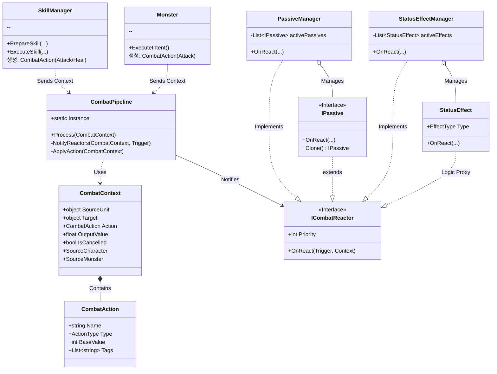
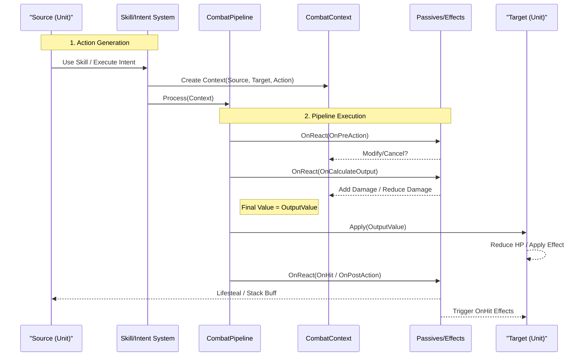

# Dice-Orbit Combat Domain Class Diagram

부제: Combat & Skill Service Architecture

이 문서는 **Action Pipeline** 패턴이 적용된 Dice Orbit의 전투 시스템을 설명합니다. 스킬, 패시브, 상태이상(Effect)이 하나의 파이프라인으로 통합되어 처리됩니다.

## 1. 시스템 아키텍처 (System Architecture)

전투 시스템은 **요청(Action Generation)**, **처리(Pipeline Processing)**, **반응(Reactive System)**의 3단계로 구성됩니다.

### 1.1 Combat Domain Class Diagram (Current)

아래 다이어그램은 ScriptableObject 기반 스킬/패시브 구조 전환 이후를 반영합니다.

> **주요 설계 원칙**
> - `CharacterActiveTemplate`, `CharacterPassive` → ScriptableObject (.asset 파일, Inspector 드래그 연결)
> - `PassiveAbility` → `[Serializable]` 유지 (몬스터 전용 인라인 패시브)
> - `IPassive` → 캐릭터/몬스터 패시브를 `PassiveManager`에서 통합 관리하는 공통 인터페이스

```mermaid
classDiagram
direction TB

namespace Core {
    class Unit {
        <<abstract>>
        +UnitStats Stats
        +OnStartTurn()
        +OnEndTurn()
        +TakeDamage(int)
        +Heal(int)
        +CollectReactors(List~ICombatReactor~)
    }

    class Character {
        +CharacterStats Stats
        +TileData CurrentTile
        +InitializeStats(CharacterStats)
        +LevelUpCharacter()
        +SyncPassiveLevelsFromRuntime()
    }

    class Monster {
        +MonsterStats Stats
        +AttackIntent CurrentIntent
        +InitializeFromPreset(MonsterPreset)
        +SelectNextIntent()
        +ExecuteIntent()
    }

    class CharacterProgressionService {
        +ApplyLevelUp(Character)
    }

    class CombatPipeline {
        +Process(CombatContext)
    }

    class CombatContext {
        +SourceUnit: Unit
        +Target: Unit
        +Action: CombatAction
        +OutputValue: float
    }

    class CombatAction {
        +Type: ActionType
        +BaseValue: int
        +Tags: List~string~
    }

    class ICombatReactor {
        <<interface>>
        +Priority:int
        +OnReact(CombatTrigger, CombatContext)
    }
}

namespace Data {
    class UnitStats {
        +MaxHP:int
        +CurrentHP:int
        +Attack:int
        +TempArmor:int
        +TakeDamage(int) int
        +Heal(int)
    }

    class CharacterStats {
        +CharacterName:string
        +Level:int
        +RuntimeAbilities: List~RuntimeAbility~
        +GetActiveAbilityByIndex(int) RuntimeAbility
    }

    class MonsterStats {
        +MonsterName:string
        +Level:int
        +Speed:int
        +DeepCopy() MonsterStats
    }

    class CharacterPreset {
        +StartingSkills: List~CharacterSkill~
        +CreateStats() CharacterStats
    }

    class MonsterPreset {
        +BaseStats: MonsterStats
        +AIPattern: MonsterAI
        +StartingPassives: List~PassiveAbility~
        +OnDeathEffects: List~DeathEffect~
        +CreateStats() MonsterStats
    }

    class MonsterAI {
        <<abstract>>
        +availableSkills: List~MonsterSkill~
        +Initialize(Monster)
        +GetNextSkill() MonsterSkill
    }

    class RandomPattern
    class SequentialPattern

    class MonsterSkill {
        +skillData: SkillData
        +GenerateIntent(Monster) AttackIntent
    }

    class AttackIntent {
        +Type: IntentType
        +TargetType: TargetType
        +Targets: List~Unit~
        +TargetTiles: List~TileData~
        +RefreshTargets()
    }

    class SkillData {
        <<abstract>>
        +SkillName:string
        +Execute(Unit, List~Unit~, List~TileData~, int)
        +ExecuteSkillWithIntent(Unit, AttackIntent)
    }

    class IPassive {
        <<interface>>
        +PassiveName:string
        +CurrentLevel:int
        +IsStackable:bool
        +Initialize(Unit)
        +SetLevel(int)
        +Clone() IPassive
        +AllowSamePassive(IPassive) bool
        +OnOwnerSelected(Character)
        +OnOwnerDeselected()
        +GetDynamicDescription() string
    }

    class CharacterPassive {
        <<abstract, ScriptableObject>>
        +passiveName:string
        +priority:int
        +Clone() IPassive
        +OnReact(CombatTrigger, CombatContext)
    }

    class CharacterActiveTemplate {
        <<abstract, ScriptableObject>>
        +Execute(Character, RuntimeAbility, List~Unit~, List~TileData~, int)
        +BuildPreview(Character, RuntimeAbility, int) string
        +CalculateRawDamage(Character, RuntimeAbility, int) int
        +Clone() CharacterActiveTemplate
    }

    class SkillAsset {
        <<abstract, ScriptableObject>>
        +Type: CharacterSkillType
        +Levels: List~SkillLevelData~
        +GetDescription(int) string
        +GetRequirement(int) DiceRequirement
    }

    class ActiveSkillAsset {
        <<ScriptableObject>>
        +TargetType: CharacterSkillTargetType
        +ActiveTemplate: CharacterActiveTemplate
    }

    class PassiveSkillAsset {
        <<ScriptableObject>>
        +PassiveTemplate: CharacterPassive
    }

    class RuntimeAbility {
        +BaseSkill: SkillAsset
        +CurrentLevel:int
        +RuntimeActiveInstance: CharacterActiveTemplate
        +RuntimePassiveInstance: IPassive
        +TryUpgrade() bool
        +Execute(...) bool
        +CanUse(int) bool
    }

    class PassiveAbility {
        <<abstract, Serializable, 몬스터 전용>>
        +PassiveName:string
        +Initialize(Unit)
        +SetLevel(int)
        +Clone() IPassive
        +OnReact(CombatTrigger, CombatContext)
    }

    class PassiveManager {
        +ActivePassives: IReadOnlyList~IPassive~
        +AddPassive(IPassive)
        +RemovePassive(IPassive)
    }

    class StatusEffect {
        +Type: EffectType
        +Value:int
        +Duration:int
        +OnReact(CombatTrigger, CombatContext)
    }

    class StatusEffectManager {
        +AddEffect(StatusEffect)
        +RemoveEffect(EffectType)
        +HasEffect(EffectType) bool
    }

    class TileData
    class DeathEffect
}

%% Inheritance
SkillAsset <|-- ActiveSkillAsset
SkillAsset <|-- PassiveSkillAsset

Unit <|-- Character
Unit <|-- Monster
UnitStats <|-- CharacterStats
UnitStats <|-- MonsterStats
MonsterAI <|-- RandomPattern
MonsterAI <|-- SequentialPattern

%% Inheritance
SkillAsset <|-- ActiveSkillAsset
SkillAsset <|-- PassiveSkillAsset
IPassive <|.. CharacterPassive : implements
IPassive <|.. PassiveAbility : implements
ICombatReactor <|.. IPassive : extends

%% Reactor implementation
PassiveManager ..|> ICombatReactor
StatusEffect ..|> ICombatReactor
StatusEffectManager ..|> ICombatReactor

%% Composition / associations
Unit o-- UnitStats
Unit o-- PassiveManager
Unit o-- StatusEffectManager

CharacterPreset ..> CharacterStats : creates
CharacterPreset o-- SkillAsset

MonsterPreset ..> MonsterStats : creates
MonsterPreset o-- MonsterAI
MonsterPreset o-- PassiveAbility : SerializeReference 인라인
MonsterPreset o-- DeathEffect

MonsterAI o-- MonsterSkill
Monster o-- MonsterAI
Monster o-- AttackIntent
MonsterSkill o-- SkillData
MonsterSkill ..> AttackIntent : generates
AttackIntent --> Unit : targets
AttackIntent --> TileData : targetTiles

ActiveSkillAsset o-- CharacterActiveTemplate : SO 드래그 연결
PassiveSkillAsset o-- CharacterPassive : SO 드래그 연결
SkillAsset o-- SkillLevelData
CharacterStats o-- RuntimeAbility
RuntimeAbility --> SkillAsset
RuntimeAbility o-- CharacterActiveTemplate : Instantiate 복사본
RuntimeAbility o-- IPassive : 런타임 인스턴스

Character ..> CharacterProgressionService : level-up policy

PassiveManager o-- IPassive
StatusEffectManager o-- StatusEffect

CombatPipeline ..> CombatContext
CombatPipeline ..> ICombatReactor
CombatContext o-- CombatAction
CombatContext --> Unit
```

```mermaid
classDiagram
    %% --- Core Pipeline ---
    class CombatPipeline {
        +static Instance
        +Process(CombatContext)
        -NotifyReactors(CombatContext, Trigger)
        -ApplyAction(CombatContext)
    }

    class CombatContext {
        +object SourceUnit
        +object Target
        +CombatAction Action
        +float OutputValue
        +bool IsCancelled
        +SourceCharacter
        +SourceMonster
    }

    class CombatAction {
        +string Name
        +ActionType Type
        +int BaseValue
        +List~string~ Tags
    }

    class ICombatReactor {
        <<Interface>>
        +OnReact(Trigger, Context)
        +int Priority
    }

    %% --- Managers (Generators) ---
    class SkillManager {
        +PrepareSkill(...)
        +ExecuteSkill(...)
        --
        생성: CombatAction(Attack/Heal)
    }

    class Monster {
        +ExecuteIntent()
        --
        생성: CombatAction(Attack)
    }

    %% --- Reactive Systems (Listeners) ---
    class PassiveManager {
        +OnReact(...)
        -List~IPassive~ activePassives
    }

    class StatusEffectManager {
        +OnReact(...)
        -List~StatusEffect~ activeEffects
    }
    
    class IPassive {
        <<Interface>>
        +OnReact(...)
        +Clone() IPassive
    }

    class StatusEffect {
        +OnReact(...)
        +EffectType Type
    }

    %% --- Relationships ---
    CombatPipeline ..> CombatContext : Uses
    CombatContext *-- CombatAction : Contains
    
    SkillManager ..> CombatPipeline : Sends Context
    Monster ..> CombatPipeline : Sends Context
    
    CombatPipeline --> ICombatReactor : Notifies
    
    PassiveManager ..|> ICombatReactor : Implements
    StatusEffectManager ..|> ICombatReactor : Implements
    
    PassiveManager o-- IPassive : Manages
    StatusEffectManager o-- StatusEffect : Manages
    
    IPassive ..|> ICombatReactor : extends
    StatusEffect ..|> ICombatReactor : Logic Proxy
```

## 2. 전투 실행 흐름 (Execution Flow)

모든 전투 행위(스킬, 몬스터 공격, 도트 데미지 등)는 `CombatPipeline`을 통과합니다.

### 2.1 전체 파이프라인 순서
1.  **Preparation**: 액션 생성 및 타겟 설정 (`CombatContext` 생성)
2.  **Pre-Action**: 액션 시작 전 단계 (취소, 회피 판정 등)
3.  **Calculation**: 수치 계산 단계 (데미지 공식, 버프/디버프 연산)
4.  **Application**: 실제 적용 (HP 감소, 힐 적용)
5.  **Reaction**: 적용 후 반응 (피격 시 효과, 흡혈, 처치 효과)

### 2.2 상세 시퀀스 다이어그램

```mermaid
sequenceDiagram
    participant Source as "Source (Unit)"
    participant SM as Skill/Intent System
    participant Pipe as CombatPipeline
    participant Context as CombatContext
    participant Reactors as Passives/Effects
    participant Target as "Target (Unit)"

    Note over Source, SM: 1. Action Generation
    Source->>SM: Use Skill / Execute Intent
    SM->>Context: Create Context(Source, Target, Action)
    SM->>Pipe: Process(Context)

    Note over Pipe, Reactors: 2. Pipeline Execution

    %% Step 1: Pre-Action
    Pipe->>Reactors: OnReact(OnPreAction)
    Reactors-->>Context: Modify/Cancel?

    %% Step 2: Calculation
    Pipe->>Reactors: OnReact(OnCalculateOutput)
    Reactors-->>Context: Add Damage / Reduce Damage
    Note right of Pipe: Final Value = OutputValue

    %% Step 3: Application
    Pipe->>Target: Apply(OutputValue)
    Target-->>Target: Reduce HP / Apply Effect

    %% Step 4: Reaction
    Pipe->>Reactors: OnReact(OnHit / OnPostAction)
    Reactors-->>Source: Lifesteal / Stack Buff
    Reactors-->>Target: Trigger OnHit Effects
```

## 3. 데이터 구조 (Data Structure)

### 스킬 에셋 구조

| 클래스 | 타입 | 역할 |
|---|---|---|
| `SkillAsset` | abstract ScriptableObject | 액티브/패시브 공통 베이스 (레벨, 조건) |
| `ActiveSkillAsset` | ScriptableObject | 액티브 스킬 에셋. `CharacterActiveTemplate` SO를 드래그로 연결 |
| `PassiveSkillAsset` | ScriptableObject | 패시브 스킬 에셋. `CharacterPassive` SO를 드래그로 연결 |
| `CharacterActiveTemplate` | abstract ScriptableObject | 캐릭터 액티브 스킬 실행 로직. 각 스킬마다 별도 .asset 생성 |
| `CharacterPassive` | abstract ScriptableObject | 캐릭터 패시브 로직. 각 패시브마다 별도 .asset 생성 |
| `PassiveAbility` | abstract `[Serializable]` | 몬스터 전용 패시브. MonsterPreset 안에 인라인 저장 (`[SerializeReference]`) |
| `IPassive` | interface | `CharacterPassive`와 `PassiveAbility` 공통 인터페이스. `PassiveManager`가 이 타입으로 관리 |

### 스킬 추가 워크플로

**캐릭터 액티브 스킬:**
1. `CharacterActiveTemplate` 상속 클래스 작성 + `[CreateAssetMenu]`
2. Project 창에서 .asset 생성 (우클릭 → Create → Dice Orbit/Active Templates/...)
3. `ActiveSkillAsset` .asset 생성 후 `Active Template` 필드에 드래그
4. `CharacterPreset.StartingSkills`에 드래그 추가

**캐릭터 패시브 스킬:**
1. `CharacterPassive` 상속 클래스 작성 + `[CreateAssetMenu]`
2. Project 창에서 .asset 생성 (우클릭 → Create → Dice Orbit/Passive Templates/...)
3. `PassiveSkillAsset` .asset 생성 후 `Passive Template` 필드에 드래그
4. `CharacterPreset.StartingSkills`에 드래그 추가

**몬스터 패시브:**
1. `PassiveAbility` 상속 클래스 작성
2. `MonsterPreset.StartingPassives` 리스트에서 `+` → 타입 선택 (인라인, .asset 불필요)

### 런타임 구조

*   **`RuntimeAbility`**: `CharacterPreset` → `CharacterStats` 생성 시 `SkillAsset`을 래핑. 액티브는 `Instantiate(ActiveTemplate)`으로 복사본 생성, 패시브는 `Instantiate(PassiveTemplate)`으로 복사본 생성.
*   **`PassiveManager`**: `IPassive` 리스트로 캐릭터/몬스터 패시브를 통합 관리.
*   **`StatusEffect`**: 런타임 버프/디버프. 자신이 부착된 유닛이 Source/Target이 될 때 `OnReact`를 통해 결과에 개입.

### 예시: 데미지 계산 공식
`OutputValue` = (`BaseDamage` + `DiceBonus`)
-> **Reactor 1 (Passive)**: `OnCalculateOutput` -> `OutputValue += 5` (공격력 증가)
-> **Reactor 2 (Target Defense Effect)**: `OnCalculateOutput` -> `OutputValue -= 2` (방어력 증가)
-> **Final Applied**: `Base + Dice + 5 - 2`
